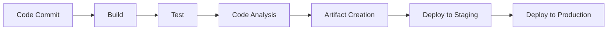

# Jenkins DevOps Complete Guide 🚀

*A comprehensive guide for DevOps engineers transitioning from beginner to 3+ years experience*

---

## Table of Contents
- [Introduction to Jenkins](#introduction-to-jenkins)
- [Prerequisites & Installation](#prerequisites--installation)
- [Jenkins Architecture & Components](#jenkins-architecture--components)
- [Pipeline Development](#pipeline-development)
- [Essential Plugins](#essential-plugins)
- [Security Best Practices](#security-best-practices)
- [Troubleshooting Guide](#troubleshooting-guide)
- [Best Practices](#best-practices)
- [Interview Preparation](#interview-preparation)
- [Real-World Scenarios](#real-world-scenarios)

---

## Introduction to Jenkins

### What is Jenkins?
Jenkins is an **open-source automation server** that enables the automation of software development processes. It provides a platform for building, testing, and deploying applications in an efficient and automated manner.

### Key Features:
- **Flexibility**: Supports various programming languages
- **Extensibility**: 1000+ plugins available
- **Integration**: Works with popular tools and frameworks
- **Community**: Large, active community support

### CI/CD Overview
**Continuous Integration and Delivery (CI/CD)** is a software development practice that involves:
- Automating code integration processes
- Building applications automatically
- Running automated tests
- Deploying to production environments

#### Primary Goals:
- ✅ Increase productivity
- ✅ Improve software quality  
- ✅ Enable rapid and frequent releases
- ✅ Reduce manual errors

### CI/CD Pipeline Components
A CI/CD pipeline consists of automated steps from version control to production:



**Common Pipeline Stages:**
- Code compilation
- Unit testing
- Code analysis
- Artifact creation
- Deployment

---

## Prerequisites & Installation

### System Requirements
- **Java**: OpenJDK 17 or higher
- **Memory**: Minimum 4GB RAM (8GB+ recommended)
- **Disk Space**: 50GB+ free space
- **OS**: Linux (Ubuntu/CentOS), Windows, or macOS

### Step 1: Install Java

```bash
# Update system packages
sudo apt update

# Install OpenJDK 17
sudo apt install openjdk-17-jre

# Verify Java installation
java -version
```

**Expected Output:**
```
openjdk version "17.0.x" 2023-xx-xx
OpenJDK Runtime Environment (build 17.0.x+x-Ubuntu-xubuntux)
```

### Step 2: Install Jenkins

```bash
# Install dependencies for Jenkins
sudo apt-get install -y ca-certificates curl gnupg

# Download Jenkins GPG key
curl -fsSL https://pkg.jenkins.io/debian/jenkins.io-2023.key | \
sudo tee /usr/share/keyrings/jenkins-keyring.asc > /dev/null

# Add Jenkins repository
echo deb [signed-by=/usr/share/keyrings/jenkins-keyring.asc] \
https://pkg.jenkins.io/debian binary/ | \
sudo tee /etc/apt/sources.list.d/jenkins.list > /dev/null

# Update package list
sudo apt-get update

# Install Jenkins
sudo apt-get install jenkins
```

### Step 3: Start Jenkins Service

```bash
# Enable Jenkins to start at boot
sudo systemctl enable jenkins

# Start Jenkins service
sudo systemctl start jenkins

# Check Jenkins service status
sudo systemctl status jenkins
```

### Step 4: Initial Setup

1. **Access Jenkins**: Navigate to `http://<your-server-ip>:8080`
2. **Get Initial Password**:
   ```bash
   sudo cat /var/lib/jenkins/secrets/initialAdminPassword
   ```
3. **Security Group**: Ensure port 8080 is open in firewall/security group
4. **Setup Admin Account**: Create username and password during setup

### Common Jenkins Commands

| Command | Description |
|---------|-------------|
| `sudo systemctl start jenkins` | Start Jenkins service |
| `sudo systemctl stop jenkins` | Stop Jenkins service |
| `sudo systemctl restart jenkins` | Restart Jenkins service |
| `sudo systemctl status jenkins` | Check service status |
| `sudo systemctl enable jenkins` | Enable auto-start at boot |
| `sudo systemctl disable jenkins` | Disable auto-start |
| `tail -f /var/log/jenkins/jenkins.log` | View Jenkins logs |

---

## Jenkins Architecture & Components

### Master-Agent Architecture

```
┌─────────────────┐    ┌─────────────────┐    ┌─────────────────┐
│   Jenkins       │    │     Agent       │    │     Agent       │
│   Master        │◄──►│     Node 1      │    │     Node 2      │
│                 │    │                 │    │                 │
│ • Job Scheduling│    │ • Build         │    │ • Test          │
│ • UI Management │    │   Execution     │    │   Execution     │
│ • Plugin Mgmt   │    │ • Workspace     │    │ • Reporting     │
└─────────────────┘    └─────────────────┘    └─────────────────┘
```

### Key Components:
- **Jenkins Master**: Controls pipelines, schedules builds, manages UI
- **Jenkins Agents**: Execute build jobs and report back to master
- **Workspaces**: Directories where build work happens
- **Jobs**: Configured tasks that Jenkins executes
- **Plugins**: Extensions that add functionality

---

## Pipeline Development

### Declarative vs Scripted Pipelines

| Feature | Declarative | Scripted |
|---------|------------|----------|
| **Syntax** | More structured | More flexible |
| **Learning Curve** | Easier | Steeper |
| **Validation** | Built-in | Manual |
| **Maintenance** | Better | Requires expertise |

### Declarative Pipeline Structure

```groovy
pipeline {
    agent any
    
    environment {
        // Define environment variables
        DEPLOY_ENV = 'staging'
    }
    
    parameters {
        string(name: 'BRANCH', defaultValue: 'main', description: 'Branch to build')
        choice(name: 'ENVIRONMENT', choices: ['dev', 'staging', 'prod'], description: 'Target environment')
    }
    
    stages {
        stage('Checkout') {
            steps {
                checkout scm
            }
        }
        
        stage('Build') {
            steps {
                sh 'echo "Building the project..."'
                sh 'mvn clean compile'
            }
        }
        
        stage('Test') {
            parallel {
                stage('Unit Tests') {
                    steps {
                        sh 'mvn test'
                    }
                }
                stage('Integration Tests') {
                    steps {
                        sh 'mvn integration-test'
                    }
                }
            }
        }
        
        stage('Code Analysis') {
            steps {
                sh 'sonar-scanner'
            }
        }
        
        stage('Package') {
            steps {
                sh 'mvn package'
                archiveArtifacts artifacts: 'target/*.jar', fingerprint: true
            }
        }
        
        stage('Deploy') {
            when {
                branch 'main'
            }
            steps {
                sh 'echo "Deploying to ${ENVIRONMENT}..."'
                // Add deployment commands here
            }
        }
    }
    
    post {
        always {
            junit 'target/test-results/*.xml'
            publishHTML([
                allowMissing: false,
                alwaysLinkToLastBuild: true,
                keepAll: true,
                reportDir: 'target/site/jacoco',
                reportFiles: 'index.html',
                reportName: 'Coverage Report'
            ])
        }
        success {
            echo 'Pipeline succeeded!'
            slackSend channel: '#devops', 
                      message: "✅ Build succeeded: ${env.JOB_NAME} - ${env.BUILD_NUMBER}"
        }
        failure {
            echo 'Pipeline failed!'
            slackSend channel: '#devops', 
                      message: "❌ Build failed: ${env.JOB_NAME} - ${env.BUILD_NUMBER}"
        }
    }
}
```

### Essential Pipeline Steps

| Step | Description | Example |
|------|-------------|---------|
| `checkout scm` | Checks out source code | `checkout scm` |
| `sh` | Execute shell commands | `sh 'mvn clean install'` |
| `archiveArtifacts` | Archive build artifacts | `archiveArtifacts 'target/*.jar'` |
| `input` | Pause for manual input | `input 'Deploy to production?'` |
| `when` | Conditional execution | `when { branch 'main' }` |
| `parallel` | Execute stages in parallel | See example above |

### Advanced Pipeline Features

#### 1. Matrix Builds
```groovy
pipeline {
    agent none
    stages {
        stage('Test') {
            matrix {
                axes {
                    axis {
                        name 'JAVA_VERSION'
                        values '8', '11', '17'
                    }
                    axis {
                        name 'OS'
                        values 'linux', 'windows'
                    }
                }
                stages {
                    stage('Build & Test') {
                        steps {
                            sh "java -version"
                            sh "mvn test"
                        }
                    }
                }
            }
        }
    }
}
```

#### 2. Shared Libraries
Create reusable pipeline code:

```groovy
// vars/buildJavaApp.groovy
def call(Map config) {
    pipeline {
        agent any
        stages {
            stage('Build') {
                steps {
                    sh "mvn clean package -Dspring.profiles.active=${config.profile}"
                }
            }
        }
    }
}
```

Usage:
```groovy
// Jenkinsfile
@Library('your-shared-library') _
buildJavaApp([profile: 'production'])
```

---

## Essential Plugins

### Core Plugins

| Plugin | Description | Use Case |
|--------|-------------|----------|
| **Git Plugin** | Git repository integration | Source code management |
| **Pipeline Plugin** | Enable pipeline syntax | CI/CD pipeline creation |
| **Docker Plugin** | Docker container management | Containerized builds |
| **Maven Plugin** | Maven build automation | Java project builds |
| **GitHub Plugin** | GitHub integration | Webhook triggers, PR builds |

### Quality & Security Plugins

| Plugin | Description | Benefits |
|--------|-------------|-----------|
| **SonarQube Plugin** | Code quality analysis | Code smell detection, security vulnerabilities |
| **OWASP Dependency Check** | Security vulnerability scanning | Identify vulnerable dependencies |
| **Checkmarx Plugin** | Static application security testing | SAST integration |

### Notification Plugins

| Plugin | Description | Configuration |
|--------|-------------|---------------|
| **Slack Notification** | Send build notifications to Slack | Requires Slack webhook URL |
| **Email Extension** | Advanced email notifications | SMTP configuration needed |
| **Microsoft Teams** | Teams integration | Teams webhook required |

### Installation Best Practices
```bash
# Install plugins via CLI (recommended for automation)
java -jar jenkins-cli.jar -s http://localhost:8080/ install-plugin git
java -jar jenkins-cli.jar -s http://localhost:8080/ install-plugin pipeline-stage-view
java -jar jenkins-cli.jar -s http://localhost:8080/ restart
```

---

## Security Best Practices

### 1. Authentication & Authorization

#### Configure Security Realms
```groovy
// Security configuration
jenkins.model.Jenkins.instance.setSecurityRealm(
    new hudson.security.HudsonPrivateSecurityRealm(false)
)

// Set authorization strategy
jenkins.model.Jenkins.instance.setAuthorizationStrategy(
    new hudson.security.ProjectMatrixAuthorizationStrategy()
)
```

#### Security Checklist:
- ✅ Enable CSRF Protection
- ✅ Use Matrix-based Authorization
- ✅ Implement Role-Based Access Control (RBAC)
- ✅ Enable audit logging
- ✅ Use Jenkins user database or LDAP integration

### 2. Credentials Management

```groovy
// Store sensitive data securely
pipeline {
    agent any
    environment {
        DB_PASSWORD = credentials('database-password')
        API_KEY = credentials('api-key-secret')
    }
    stages {
        stage('Deploy') {
            steps {
                sh '''
                    docker run -e DB_PASS=$DB_PASSWORD \
                               -e API_KEY=$API_KEY \
                               myapp:latest
                '''
            }
        }
    }
}
```

### 3. Network Security
- Use HTTPS for Jenkins UI
- Restrict Jenkins master access
- Use VPN for agent connections
- Implement firewall rules

### 4. Plugin Security
```bash
# Regular security updates
sudo apt update jenkins
# Review plugin permissions
# Remove unused plugins
```

---

## Troubleshooting Guide

### Common Issues & Solutions

#### 1. Pipeline Failures

**Issue**: Build fails with "Permission Denied"
```bash
# Solution: Fix file permissions
chmod +x ./scripts/deploy.sh
# Or in pipeline:
sh 'chmod +x ./scripts/deploy.sh'
```

**Issue**: Agent not connecting
```bash
# Check agent logs
tail -f /var/log/jenkins/jenkins.log

# Verify network connectivity
telnet jenkins-master 50000

# Restart agent service
sudo systemctl restart jenkins-agent
```

#### 2. Performance Issues

**Memory Issues**:
```bash
# Increase Jenkins heap size
sudo vim /etc/default/jenkins
# Add: JENKINS_JAVA_OPTIONS="-Djava.awt.headless=true -Xmx4g -Xms2g"
sudo systemctl restart jenkins
```

**Disk Space Issues**:
```bash
# Clean old builds
find /var/lib/jenkins/jobs -name "builds" -exec rm -rf {}/*/archive \;

# Configure build retention
pipeline {
    options {
        buildDiscarder(logRotator(numToKeepStr: '10'))
    }
}
```

#### 3. Plugin Issues

```bash
# Plugin conflicts
java -jar jenkins-cli.jar list-plugins | grep -i error

# Safe plugin update
# 1. Backup Jenkins home
sudo cp -r /var/lib/jenkins /backup/jenkins-$(date +%Y%m%d)
# 2. Update plugins via UI
# 3. Test thoroughly
```

### Debugging Pipeline Issues

```groovy
pipeline {
    agent any
    stages {
        stage('Debug') {
            steps {
                script {
                    // Print all environment variables
                    sh 'printenv | sort'
                    
                    // Debug specific issues
                    echo "Current workspace: ${env.WORKSPACE}"
                    echo "Build number: ${env.BUILD_NUMBER}"
                    echo "Job name: ${env.JOB_NAME}"
                }
            }
        }
    }
}
```

---

## Best Practices

### 1. Pipeline Design

#### Keep Pipelines Modular
```groovy
// Bad - monolithic pipeline
pipeline {
    stages {
        stage('Everything') {
            steps {
                sh 'build.sh && test.sh && deploy.sh'
            }
        }
    }
}

// Good - modular pipeline
pipeline {
    stages {
        stage('Build') { steps { sh './scripts/build.sh' } }
        stage('Test') { steps { sh './scripts/test.sh' } }
        stage('Deploy') { steps { sh './scripts/deploy.sh' } }
    }
}
```

#### Version Control Best Practices
- ✅ Store `Jenkinsfile` in repository root
- ✅ Use branches for pipeline development
- ✅ Implement code reviews for pipeline changes
- ✅ Tag pipeline versions

#### Error Handling
```groovy
pipeline {
    agent any
    stages {
        stage('Risky Operation') {
            steps {
                script {
                    try {
                        sh 'risky-command'
                    } catch (Exception e) {
                        currentBuild.result = 'UNSTABLE'
                        echo "Warning: ${e.getMessage()}"
                    }
                }
            }
        }
    }
}
```

### 2. Performance Optimization

#### Resource Management
```groovy
pipeline {
    agent {
        label 'high-memory'
    }
    options {
        timeout(time: 30, unit: 'MINUTES')
        retry(3)
        skipStagesAfterUnstable()
    }
    stages {
        stage('Heavy Task') {
            steps {
                sh 'memory-intensive-process'
            }
        }
    }
}
```

#### Parallel Execution
```groovy
pipeline {
    stages {
        stage('Parallel Tests') {
            parallel {
                stage('Unit Tests') {
                    steps { sh 'mvn test' }
                }
                stage('Integration Tests') {
                    steps { sh 'mvn integration-test' }
                }
                stage('Security Scan') {
                    steps { sh 'security-scan.sh' }
                }
            }
        }
    }
}
```

### 3. Maintenance Guidelines

#### Regular Tasks
- **Weekly**: Review failed builds and optimize
- **Monthly**: Update plugins and Jenkins core
- **Quarterly**: Clean up old builds and artifacts
- **Annually**: Review security configurations

#### Backup Strategy
```bash
#!/bin/bash
# Jenkins backup script
BACKUP_DIR="/backup/jenkins"
JENKINS_HOME="/var/lib/jenkins"
DATE=$(date +%Y%m%d_%H%M%S)

# Create backup
tar -czf "${BACKUP_DIR}/jenkins_backup_${DATE}.tar.gz" \
    --exclude="${JENKINS_HOME}/workspace" \
    --exclude="${JENKINS_HOME}/builds/*/archive" \
    "${JENKINS_HOME}"

# Keep only last 10 backups
ls -t ${BACKUP_DIR}/jenkins_backup_*.tar.gz | tail -n +11 | xargs rm -f
```

---

## Interview Preparation

### Common Jenkins Interview Questions

#### 1. Basic Questions
**Q: What is Jenkins and why is it used?**
**A:** Jenkins is an open-source automation server used for Continuous Integration and Continuous Delivery (CI/CD). It automates the process of building, testing, and deploying applications, enabling teams to deliver software faster and with fewer errors.

**Q: Explain the difference between Freestyle and Pipeline jobs.**
**A:** 
- **Freestyle**: GUI-based configuration, limited flexibility, harder to version control
- **Pipeline**: Code-as-configuration, highly flexible, version controlled, supports complex workflows

#### 2. Intermediate Questions
**Q: How would you handle a failing step in a pipeline?**
```groovy
pipeline {
    stages {
        stage('Build') {
            steps {
                script {
                    try {
                        sh 'mvn clean install'
                    } catch (Exception e) {
                        currentBuild.result = 'UNSTABLE'
                        echo "Build failed: ${e.getMessage()}"
                        // Send notification
                        slackSend message: "Build failed: ${e.getMessage()}"
                    }
                }
            }
        }
    }
}
```

**Q: How do you integrate Jenkins with Git?**
**A:** 
1. Install Git plugin
2. Configure Git in Global Tool Configuration
3. Use SCM polling or webhooks for triggering
4. Example webhook URL: `http://jenkins-server:8080/github-webhook/`

#### 3. Advanced Questions
**Q: How would you scale Jenkins for a large organization?**
**A:**
- Implement master-agent architecture
- Use Docker containers for agents
- Implement shared libraries for code reuse
- Use Jenkins Configuration as Code (JCasC)
- Implement proper monitoring and alerting

**Q: Describe your approach to Jenkins security.**
**A:**
- Enable CSRF protection
- Implement role-based access control
- Use credentials plugin for secrets
- Regular security updates
- Network segmentation
- Audit logging

### Technical Scenarios

#### Scenario 1: Multi-Environment Deployment
```groovy
pipeline {
    parameters {
        choice(name: 'ENVIRONMENT', choices: ['dev', 'staging', 'production'])
        booleanParam(name: 'SKIP_TESTS', defaultValue: false)
    }
    
    stages {
        stage('Deploy') {
            steps {
                script {
                    def deployConfig = [
                        'dev': [replicas: 1, resources: 'small'],
                        'staging': [replicas: 2, resources: 'medium'],
                        'production': [replicas: 5, resources: 'large']
                    ]
                    
                    def config = deployConfig[params.ENVIRONMENT]
                    sh "helm upgrade --install myapp ./chart --set replicas=${config.replicas}"
                }
            }
        }
    }
}
```

#### Scenario 2: Blue-Green Deployment
```groovy
pipeline {
    stages {
        stage('Deploy to Blue') {
            steps {
                sh 'kubectl apply -f k8s-blue.yaml'
                sh 'kubectl wait --for=condition=ready pod -l version=blue'
            }
        }
        stage('Health Check') {
            steps {
                script {
                    def response = sh(
                        script: 'curl -s -o /dev/null -w "%{http_code}" http://blue-service/health',
                        returnStdout: true
                    ).trim()
                    
                    if (response != '200') {
                        error("Health check failed with status: ${response}")
                    }
                }
            }
        }
        stage('Switch Traffic') {
            input {
                message "Switch traffic to blue environment?"
                ok "Deploy"
            }
            steps {
                sh 'kubectl patch service myapp -p \'{"spec":{"selector":{"version":"blue"}}}\''
            }
        }
    }
}
```

---

## Real-World Scenarios

### Scenario 1: Microservices CI/CD

```groovy
// Multi-service pipeline
pipeline {
    agent any
    
    stages {
        stage('Detect Changes') {
            steps {
                script {
                    def changes = sh(
                        script: 'git diff --name-only HEAD~1',
                        returnStdout: true
                    ).split('\n')
                    
                    env.BUILD_USER_SERVICE = changes.any { it.startsWith('user-service/') }
                    env.BUILD_ORDER_SERVICE = changes.any { it.startsWith('order-service/') }
                    env.BUILD_PAYMENT_SERVICE = changes.any { it.startsWith('payment-service/') }
                }
            }
        }
        
        stage('Build Services') {
            parallel {
                stage('User Service') {
                    when { environment name: 'BUILD_USER_SERVICE', value: 'true' }
                    steps {
                        dir('user-service') {
                            sh 'mvn clean package'
                            sh 'docker build -t user-service:${BUILD_NUMBER} .'
                        }
                    }
                }
                stage('Order Service') {
                    when { environment name: 'BUILD_ORDER_SERVICE', value: 'true' }
                    steps {
                        dir('order-service') {
                            sh 'mvn clean package'
                            sh 'docker build -t order-service:${BUILD_NUMBER} .'
                        }
                    }
                }
                stage('Payment Service') {
                    when { environment name: 'BUILD_PAYMENT_SERVICE', value: 'true' }
                    steps {
                        dir('payment-service') {
                            sh 'mvn clean package'
                            sh 'docker build -t payment-service:${BUILD_NUMBER} .'
                        }
                    }
                }
            }
        }
    }
}
```

### Scenario 2: Infrastructure as Code Integration

```groovy
pipeline {
    agent any
    
    stages {
        stage('Terraform Plan') {
            steps {
                dir('terraform') {
                    sh 'terraform init'
                    sh 'terraform plan -out=tfplan'
                    archiveArtifacts 'tfplan'
                }
            }
        }
        
        stage('Security Scan') {
            parallel {
                stage('Terraform Security') {
                    steps {
                        sh 'tfsec terraform/'
                    }
                }
                stage('Docker Security') {
                    steps {
                        sh 'trivy image myapp:${BUILD_NUMBER}'
                    }
                }
            }
        }
        
        stage('Deploy Infrastructure') {
            input {
                message "Deploy infrastructure changes?"
                parameters {
                    choice(name: 'ACTION', choices: ['apply', 'destroy'])
                }
            }
            steps {
                dir('terraform') {
                    script {
                        if (params.ACTION == 'apply') {
                            sh 'terraform apply tfplan'
                        } else {
                            sh 'terraform destroy -auto-approve'
                        }
                    }
                }
            }
        }
    }
}
```

### Scenario 3: Compliance & Audit Pipeline

```groovy
pipeline {
    agent any
    
    stages {
        stage('Compliance Checks') {
            parallel {
                stage('License Compliance') {
                    steps {
                        sh 'license-checker --production --json > licenses.json'
                        archiveArtifacts 'licenses.json'
                    }
                }
                
                stage('Security Compliance') {
                    steps {
                        sh 'npm audit --json > security-audit.json'
                        sh 'sonar-scanner'
                    }
                }
                
                stage('Code Quality Gate') {
                    steps {
                        script {
                            def qg = waitForQualityGate()
                            if (qg.status != 'OK') {
                                error "Pipeline aborted due to quality gate failure: ${qg.status}"
                            }
                        }
                    }
                }
            }
        }
        
        stage('Generate Reports') {
            steps {
                publishHTML([
                    allowMissing: false,
                    alwaysLinkToLastBuild: true,
                    keepAll: true,
                    reportDir: 'reports',
                    reportFiles: 'compliance-report.html',
                    reportName: 'Compliance Report'
                ])
            }
        }
    }
    
    post {
        always {
            // Send audit trail to compliance system
            sh 'curl -X POST -H "Content-Type: application/json" \
                -d @compliance-data.json \
                https://compliance-api.company.com/audit'
        }
    }
}
```

---

## Advanced Topics & Career Tips

### 1. Jenkins as Code (JCasC)

```yaml
# jenkins.yaml
jenkins:
  systemMessage: "Jenkins managed by Configuration as Code"
  numExecutors: 0
  scmCheckoutRetryCount: 2
  
  securityRealm:
    local:
      allowsSignup: false
      users:
        - id: admin
          password: ${ADMIN_PASSWORD}
          
  authorizationStrategy:
    projectMatrix:
      permissions:
        - "Overall/Administer:admin"
        - "Job/Read:authenticated"

tool:
  git:
    installations:
      - name: git
        home: /usr/bin/git
        
  maven:
    installations:
      - name: maven-3.8
        home: /opt/maven
```

### 2. Pipeline Libraries Best Practices

```groovy
// vars/deployToK8s.groovy
def call(Map config) {
    script {
        sh """
            helm upgrade --install ${config.appName} ./charts/${config.appName} \
            --namespace ${config.namespace} \
            --set image.tag=${config.imageTag} \
            --set replicas=${config.replicas}
        """
    }
}

// Usage in Jenkinsfile
@Library('devops-shared-library@v1.0') _

pipeline {
    stages {
        stage('Deploy') {
            steps {
                deployToK8s([
                    appName: 'my-app',
                    namespace: 'production',
                    imageTag: env.BUILD_NUMBER,
                    replicas: 3
                ])
            }
        }
    }
}
```

### 3. Career Progression Tips

#### For 3+ Years Experience Level:

**Technical Skills to Master:**
- Advanced pipeline patterns (matrix, parallel, conditional)
- Jenkins shared libraries development
- Integration with modern tools (Docker, Kubernetes, Terraform)
- Security and compliance automation
- Performance optimization and scaling

**Leadership Skills:**
- Mentor junior team members
- Lead CI/CD strategy discussions
- Drive DevOps transformation initiatives
- Present technical solutions to stakeholders

**Industry Recognition:**
- Contribute to open-source Jenkins plugins
- Write technical blogs about Jenkins best practices
- Speak at DevOps conferences
- Obtain relevant certifications

#### Interview Success Tips:

1. **Prepare Real Examples**: Have concrete examples of pipelines you've built
2. **Understand Business Impact**: Explain how your Jenkins work improved team productivity
3. **Stay Updated**: Know the latest Jenkins features and industry trends
4. **Practice Coding**: Be ready to write pipeline code during interviews
5. **Know Integration Points**: Understand how Jenkins fits in the broader DevOps toolchain

---

## Conclusion

This guide provides a comprehensive foundation for Jenkins mastery. As you progress in your DevOps career:

1. **Practice Regularly**: Build real projects, not just tutorials
2. **Stay Updated**: Jenkins evolves rapidly - follow release notes
3. **Community Engagement**: Join Jenkins community forums and events  
4. **Continuous Learning**: Explore adjacent technologies (Docker, Kubernetes, Terraform)
5. **Document Everything**: Keep track of solutions you've implemented

Remember: Jenkins is a tool, but DevOps is a culture. Focus on improving team collaboration, automation, and delivery speed.

---

## Resources & References

- **Official Documentation**: [jenkins.io/doc](https://jenkins.io/doc/)
- **Jenkins Community**: [jenkins.io/participate](https://jenkins.io/participate/)
- **Plugin Index**: [plugins.jenkins.io](https://plugins.jenkins.io/)
- **Best Practices**: [jenkins.io/doc/book/pipeline/best-practices](https://jenkins.io/doc/book/pipeline/best-practices/)
- **Jenkins Configuration as Code**: [github.com/jenkinsci/configuration-as-code-plugin](https://github.com/jenkinsci/configuration-as-code-plugin)
