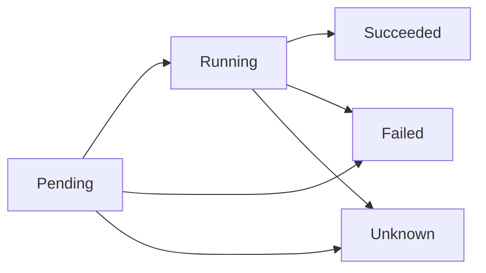
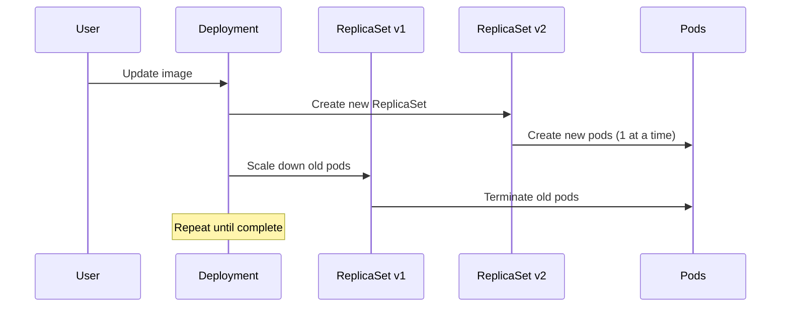

# 02 - Pods and Workloads 🚀

*Understanding Pods, ReplicaSets, Deployments, and advanced workload management*

---

## Table of Contents
- [Understanding Pods](#understanding-pods)
- [Pod Lifecycle](#pod-lifecycle)
- [Multi-Container Pods](#multi-container-pods)
- [ReplicationController](#replicationcontroller)
- [ReplicaSets](#replicasets)
- [Deployments](#deployments)
- [Rolling Updates and Rollbacks](#rolling-updates-and-rollbacks)
- [Advanced Workload Types](#advanced-workload-types)
- [Labels and Selectors](#labels-and-selectors)
- [Node Selection](#node-selection)
- [Best Practices](#best-practices)
- [Hands-on Exercises](#hands-on-exercises)

---

## Understanding Pods

### What is a Pod?

A **Pod** is the smallest deployable unit in Kubernetes. It represents a group of one or more containers that:
- Share the same network (IP address and port space)
- Share storage volumes
- Are scheduled together on the same node
- Live and die together

```
┌─────────────────────────────────────┐
│               Pod                   │
│  ┌─────────────┐  ┌─────────────┐   │
│  │ Container A │  │ Container B │   │
│  │             │  │             │   │
│  └─────────────┘  └─────────────┘   │
│         │                │         │
│         └────────────────┘         │
│           Shared Network           │
│         (localhost:port)           │
│                                   │
│  ┌─────────────────────────────┐   │
│  │      Shared Volumes         │   │
│  └─────────────────────────────┘   │
└─────────────────────────────────────┘
```

### Pod Characteristics

#### ✅ **Pod Design Principles**
- **One main process per pod** (most common)
- Containers in a pod are tightly coupled
- Ephemeral by nature (mortal)
- Each pod gets a unique IP address
- Pods can scale horizontally

#### ✅ **Pod Communication**
- Containers within a pod communicate via `localhost`
- Different ports for different containers
- Shared filesystem through volumes

### Basic Pod Example

```yaml
apiVersion: v1
kind: Pod
metadata:
  name: web-pod
  labels:
    app: web
    tier: frontend
spec:
  containers:
  - name: nginx
    image: nginx:1.21
    ports:
    - containerPort: 80
      name: http
    resources:
      requests:
        cpu: 100m
        memory: 128Mi
      limits:
        cpu: 500m
        memory: 256Mi
```

### Pod Manifest Structure

```yaml
apiVersion: v1              # API version for pods
kind: Pod                   # Resource type
metadata:
  name: pod-name            # Required: unique name
  namespace: default        # Optional: defaults to 'default'
  labels:                   # Optional: key-value pairs for identification
    app: myapp
    version: v1.0
  annotations:              # Optional: non-identifying metadata
    description: "My application pod"
spec:                       # Pod specification
  containers:               # Required: list of containers
  - name: container-name    # Required: container name
    image: image:tag        # Required: container image
    # ... other container specs
```

---

## Pod Lifecycle

### Pod Phases



| Phase | Description |
|-------|-------------|
| **Pending** | Pod accepted but not yet scheduled or containers not created |
| **Running** | Pod bound to node, all containers created, at least one running |
| **Succeeded** | All containers terminated successfully (for completed jobs) |
| **Failed** | All containers terminated, at least one failed |
| **Unknown** | Pod state cannot be determined (communication issues) |

### Container States

#### **Waiting**
```yaml
state:
  waiting:
    reason: ImagePullBackOff
    message: "Back-off pulling image nginx:invalid-tag"
```

#### **Running**
```yaml
state:
  running:
    startedAt: "2025-01-15T10:30:00Z"
```

#### **Terminated**
```yaml
state:
  terminated:
    exitCode: 0
    finishedAt: "2025-01-15T11:00:00Z"
    reason: Completed
```

### Pod Conditions

```bash
# Check pod conditions
kubectl describe pod <pod-name>

# Common conditions:
# - PodScheduled: Pod has been scheduled to a node
# - Initialized: All init containers completed
# - ContainersReady: All containers are ready
# - Ready: Pod is ready to serve requests
```

### Restart Policies

```yaml
spec:
  restartPolicy: Always    # Default: Always restart
  # restartPolicy: OnFailure  # Restart only on failure
  # restartPolicy: Never      # Never restart
```

---

## Multi-Container Pods

### When to Use Multi-Container Pods

#### ✅ **Good Use Cases**
- **Sidecar pattern**: Helper containers (logging, monitoring)
- **Ambassador pattern**: Proxy for external services
- **Adapter pattern**: Modify data format for main container

#### ❌ **Avoid Multi-Container When**
- Containers can run independently
- Different scaling requirements
- Different lifecycle requirements

### Sidecar Pattern Example

```yaml
apiVersion: v1
kind: Pod
metadata:
  name: web-with-sidecar
spec:
  containers:
  # Main application container
  - name: web-app
    image: nginx:1.21
    ports:
    - containerPort: 80
    volumeMounts:
    - name: shared-logs
      mountPath: /var/log/nginx
      
  # Sidecar container for log processing
  - name: log-agent
    image: fluentd:v1.14
    volumeMounts:
    - name: shared-logs
      mountPath: /var/log/nginx
      readOnly: true
    - name: fluentd-config
      mountPath: /fluentd/etc
      
  volumes:
  - name: shared-logs
    emptyDir: {}
  - name: fluentd-config
    configMap:
      name: fluentd-config
```

### Ambassador Pattern Example

```yaml
apiVersion: v1
kind: Pod
metadata:
  name: app-with-ambassador
spec:
  containers:
  # Main application
  - name: app
    image: myapp:latest
    ports:
    - containerPort: 8080
    env:
    - name: DATABASE_URL
      value: "localhost:5432"  # Connects to ambassador
      
  # Ambassador proxy for external database
  - name: db-ambassador
    image: haproxy:2.4
    ports:
    - containerPort: 5432
    volumeMounts:
    - name: ambassador-config
      mountPath: /usr/local/etc/haproxy
      
  volumes:
  - name: ambassador-config
    configMap:
      name: haproxy-config
```

---

## ReplicationController

### Overview
ReplicationController (RC) ensures a specified number of pod replicas are running at all times.

> **Note**: ReplicationController is deprecated. Use ReplicaSet instead.

### Basic RC Example

```yaml
apiVersion: v1
kind: ReplicationController
metadata:
  name: nginx-rc
spec:
  replicas: 3
  selector:
    app: nginx
  template:
    metadata:
      labels:
        app: nginx
    spec:
      containers:
      - name: nginx
        image: nginx:1.21
        ports:
        - containerPort: 80
```

### RC Features
- ✅ **Auto-healing**: Replaces failed pods
- ✅ **Scaling**: Maintains desired replica count
- ❌ **Limited selectors**: Only equality-based selectors
- ❌ **No rolling updates**: Manual update process

---

## ReplicaSets

### What is a ReplicaSet?

A **ReplicaSet** is the next-generation ReplicationController with enhanced selector support.

### Key Improvements over RC
- **Set-based selectors**: More flexible pod selection
- **Better integration**: Used by Deployments
- **Enhanced matching**: `matchLabels` and `matchExpressions`

### ReplicaSet Example

```yaml
apiVersion: apps/v1
kind: ReplicaSet
metadata:
  name: web-replicaset
  labels:
    app: web
spec:
  replicas: 3
  selector:
    matchLabels:
      app: web
      tier: frontend
    matchExpressions:
    - key: environment
      operator: In
      values: ["prod", "staging"]
  template:
    metadata:
      labels:
        app: web
        tier: frontend
        environment: prod
    spec:
      containers:
      - name: nginx
        image: nginx:1.21
        ports:
        - containerPort: 80
        resources:
          requests:
            cpu: 100m
            memory: 128Mi
```

### Selector Types

#### **matchLabels** (Equality-based)
```yaml
selector:
  matchLabels:
    app: web
    version: v1
```

#### **matchExpressions** (Set-based)
```yaml
selector:
  matchExpressions:
  - key: tier
    operator: In
    values: ["frontend", "backend"]
  - key: environment
    operator: NotIn
    values: ["debug"]
  - key: app
    operator: Exists
```

**Operators:**
- `In`: Label value in given set
- `NotIn`: Label value not in given set
- `Exists`: Label key exists
- `DoesNotExist`: Label key doesn't exist

### Managing ReplicaSets

```bash
# Create ReplicaSet
kubectl apply -f replicaset.yaml

# Scale ReplicaSet
kubectl scale replicaset web-replicaset --replicas=5
kubectl scale --replicas=5 -f replicaset.yaml

# Check ReplicaSet status
kubectl get replicasets
kubectl describe replicaset web-replicaset

# Delete ReplicaSet (keeps pods)
kubectl delete replicaset web-replicaset --cascade=false

# Delete ReplicaSet (deletes pods)
kubectl delete replicaset web-replicaset
```

---

## Deployments

### What is a Deployment?

A **Deployment** is a higher-level object that manages ReplicaSets and provides declarative updates to pods.

```
Deployment → ReplicaSet → Pods
```

### Deployment Features
- ✅ **Rolling Updates**: Zero-downtime deployments
- ✅ **Rollback**: Easy rollback to previous versions
- ✅ **Scaling**: Horizontal pod scaling
- ✅ **Version Control**: Deployment revision history
- ✅ **Pause/Resume**: Control update process

### Complete Deployment Example

```yaml
apiVersion: apps/v1
kind: Deployment
metadata:
  name: web-deployment
  labels:
    app: web
spec:
  replicas: 3
  strategy:
    type: RollingUpdate
    rollingUpdate:
      maxUnavailable: 1
      maxSurge: 1
  selector:
    matchLabels:
      app: web
  template:
    metadata:
      labels:
        app: web
        version: v1.0
    spec:
      containers:
      - name: nginx
        image: nginx:1.21
        ports:
        - containerPort: 80
          name: http
        resources:
          requests:
            cpu: 100m
            memory: 128Mi
          limits:
            cpu: 500m
            memory: 256Mi
        livenessProbe:
          httpGet:
            path: /
            port: 80
          initialDelaySeconds: 30
          periodSeconds: 10
        readinessProbe:
          httpGet:
            path: /
            port: 80
          initialDelaySeconds: 5
          periodSeconds: 5
```

### Deployment Strategies

#### 1. **Rolling Update** (Default)
```yaml
spec:
  strategy:
    type: RollingUpdate
    rollingUpdate:
      maxUnavailable: 25%  # Max pods unavailable during update
      maxSurge: 25%        # Max pods above desired count
```

#### 2. **Recreate Strategy**
```yaml
spec:
  strategy:
    type: Recreate
```

### Deployment Status

```bash
# Check deployment status
kubectl get deployments

# Output example:
NAME             READY   UP-TO-DATE   AVAILABLE   AGE
web-deployment   3/3     3            3           5m
```

**Field Meanings:**
- **READY**: Ready replicas / Desired replicas
- **UP-TO-DATE**: Updated replicas count
- **AVAILABLE**: Available replicas to users
- **AGE**: Time since creation

---

## Rolling Updates and Rollbacks

### Rolling Update Process



### Update Deployment

```bash
# Method 1: Update image
kubectl set image deployment/web-deployment nginx=nginx:1.22

# Method 2: Edit deployment
kubectl edit deployment web-deployment

# Method 3: Apply updated manifest
kubectl apply -f updated-deployment.yaml

# Method 4: Patch deployment
kubectl patch deployment web-deployment -p '{"spec":{"template":{"spec":{"containers":[{"name":"nginx","image":"nginx:1.22"}]}}}}'
```

### Monitor Rolling Update

```bash
# Watch rollout status
kubectl rollout status deployment/web-deployment

# Check rollout history
kubectl rollout history deployment/web-deployment

# Check specific revision
kubectl rollout history deployment/web-deployment --revision=2
```

### Rollback Operations

```bash
# Rollback to previous version
kubectl rollout undo deployment/web-deployment

# Rollback to specific revision
kubectl rollout undo deployment/web-deployment --to-revision=1

# Check rollback status
kubectl rollout status deployment/web-deployment
```

### Pause and Resume Updates

```bash
# Pause rollout
kubectl rollout pause deployment/web-deployment

# Make multiple changes while paused
kubectl set image deployment/web-deployment nginx=nginx:1.22
kubectl set resources deployment/web-deployment -c nginx --limits=cpu=200m,memory=256Mi

# Resume rollout
kubectl rollout resume deployment/web-deployment
```

### Deployment History Management

```yaml
# Configure revision history limit
spec:
  revisionHistoryLimit: 10  # Keep last 10 ReplicaSets
```

---

## Advanced Workload Types

### 1. **DaemonSet**

Ensures a pod runs on every (or selected) node.

```yaml
apiVersion: apps/v1
kind: DaemonSet
metadata:
  name: fluentd-daemonset
spec:
  selector:
    matchLabels:
      name: fluentd
  template:
    metadata:
      labels:
        name: fluentd
    spec:
      containers:
      - name: fluentd
        image: fluentd:v1.14
        volumeMounts:
        - name: varlog
          mountPath: /var/log
          readOnly: true
      volumes:
      - name: varlog
        hostPath:
          path: /var/log
```

**Use Cases:**
- Log collection (Fluentd, Filebeat)
- Monitoring agents (Node Exporter)
- Network plugins
- Storage daemons

### 2. **StatefulSet**

Manages stateful applications with stable identities.

```yaml
apiVersion: apps/v1
kind: StatefulSet
metadata:
  name: mysql-statefulset
spec:
  serviceName: mysql
  replicas: 3
  selector:
    matchLabels:
      app: mysql
  template:
    metadata:
      labels:
        app: mysql
    spec:
      containers:
      - name: mysql
        image: mysql:8.0
        env:
        - name: MYSQL_ROOT_PASSWORD
          value: "rootpassword"
        volumeMounts:
        - name: mysql-data
          mountPath: /var/lib/mysql
  volumeClaimTemplates:
  - metadata:
      name: mysql-data
    spec:
      accessModes: ["ReadWriteOnce"]
      resources:
        requests:
          storage: 10Gi
```

**Features:**
- Stable network identities (pod-0, pod-1, pod-2)
- Stable persistent storage
- Ordered deployment and scaling
- Ordered updates

### 3. **Job**

Runs pods to completion for batch processing.

```yaml
apiVersion: batch/v1
kind: Job
metadata:
  name: data-processing
spec:
  completions: 1
  parallelism: 1
  backoffLimit: 3
  template:
    spec:
      containers:
      - name: processor
        image: python:3.9
        command: ["python", "/scripts/process_data.py"]
        volumeMounts:
        - name: data-volume
          mountPath: /data
      restartPolicy: Never
      volumes:
      - name: data-volume
        persistentVolumeClaim:
          claimName: data-pvc
```

### 4. **CronJob**

Runs jobs on a scheduled basis.

```yaml
apiVersion: batch/v1
kind: CronJob
metadata:
  name: backup-cronjob
spec:
  schedule: "0 2 * * *"  # Daily at 2 AM
  jobTemplate:
    spec:
      template:
        spec:
          containers:
          - name: backup
            image: backup-tool:latest
            command:
            - /bin/sh
            - -c
            - |
              echo "Starting backup at $(date)"
              # Backup commands here
              echo "Backup completed at $(date)"
          restartPolicy: OnFailure
```

**Cron Schedule Examples:**
- `"0 * * * *"`: Every hour
- `"*/5 * * * *"`: Every 5 minutes
- `"0 2 * * MON"`: Every Monday at 2 AM
- `"0 0 1 * *"`: First day of every month

---

## Labels and Selectors

### Label Best Practices

```yaml
metadata:
  labels:
    # Recommended labels
    app: myapp                    # Application name
    version: v1.2.3              # Application version
    component: frontend          # Component within app
    part-of: ecommerce-system   # Larger system
    managed-by: helm            # Management tool
    
    # Environment labels
    environment: production     # Environment type
    tier: web                   # Application tier
    
    # Organizational labels
    team: backend              # Responsible team
    cost-center: engineering   # Cost allocation
```

### Advanced Selectors

#### **Equality-based**
```bash
# Single label
kubectl get pods -l app=web

# Multiple labels (AND)
kubectl get pods -l app=web,tier=frontend

# Exclusion
kubectl get pods -l app!=web
```

#### **Set-based**
```bash
# IN operator
kubectl get pods -l 'environment in (production,staging)'

# NOT IN operator
kubectl get pods -l 'tier notin (cache,proxy)'

# EXISTS
kubectl get pods -l app

# NOT EXISTS
kubectl get pods -l '!version'
```

### Label Management

```bash
# Add label
kubectl label pod mypod version=v1.0

# Update label
kubectl label pod mypod version=v2.0 --overwrite

# Remove label
kubectl label pod mypod version-

# Label nodes
kubectl label nodes node1 disktype=ssd
kubectl label nodes node1 zone=us-west1-a
```

---

## Node Selection

### Node Selector

Simple node selection using labels:

```yaml
spec:
  nodeSelector:
    disktype: ssd
    zone: us-west1-a
  containers:
  - name: app
    image: myapp:latest
```

### Node Affinity

More expressive node selection:

```yaml
spec:
  affinity:
    nodeAffinity:
      requiredDuringSchedulingIgnoredDuringExecution:
        nodeSelectorTerms:
        - matchExpressions:
          - key: disktype
            operator: In
            values: ["ssd", "nvme"]
      preferredDuringSchedulingIgnoredDuringExecution:
      - weight: 80
        preference:
          matchExpressions:
          - key: zone
            operator: In
            values: ["us-west1-a"]
      - weight: 20
        preference:
          matchExpressions:
          - key: instance-type
            operator: In
            values: ["c5.large"]
```

### Pod Affinity and Anti-Affinity

#### **Pod Affinity** (Schedule pods together)
```yaml
spec:
  affinity:
    podAffinity:
      requiredDuringSchedulingIgnoredDuringExecution:
      - labelSelector:
          matchExpressions:
          - key: app
            operator: In
            values: ["database"]
        topologyKey: kubernetes.io/hostname
```

#### **Pod Anti-Affinity** (Schedule pods apart)
```yaml
spec:
  affinity:
    podAntiAffinity:
      preferredDuringSchedulingIgnoredDuringExecution:
      - weight: 100
        podAffinityTerm:
          labelSelector:
            matchExpressions:
            - key: app
              operator: In
              values: ["web"]
          topologyKey: kubernetes.io/hostname
```

### Taints and Tolerations

#### **Taints** (Node-level)
```bash
# Add taint to node
kubectl taint nodes node1 key=value:NoSchedule

# Remove taint
kubectl taint nodes node1 key=value:NoSchedule-

# Taint effects:
# NoSchedule: New pods not scheduled
# PreferNoSchedule: Try to avoid scheduling
# NoExecute: Evict existing pods
```

#### **Tolerations** (Pod-level)
```yaml
spec:
  tolerations:
  - key: "key"
    operator: "Equal"
    value: "value"
    effect: "NoSchedule"
  - key: "example.com/special-node"
    operator: "Exists"
    effect: "NoSchedule"
```

---

## Best Practices

### 1. **Resource Management**

```yaml
spec:
  containers:
  - name: app
    resources:
      requests:          # Guaranteed resources
        cpu: 100m
        memory: 128Mi
      limits:           # Maximum resources
        cpu: 500m
        memory: 256Mi
```

**Guidelines:**
- Always set resource requests
- Set limits to prevent resource hogging
- Use appropriate CPU units (m = milliCPU)
- Monitor resource usage regularly

### 2. **Health Checks**

```yaml
spec:
  containers:
  - name: app
    livenessProbe:
      httpGet:
        path: /health
        port: 8080
      initialDelaySeconds: 30
      periodSeconds: 10
      timeoutSeconds: 5
      failureThreshold: 3
    readinessProbe:
      httpGet:
        path: /ready
        port: 8080
      initialDelaySeconds: 5
      periodSeconds: 5
```

**Probe Types:**
- **HTTP GET**: Check HTTP endpoint
- **TCP Socket**: Check port connectivity
- **Command**: Execute command in container

### 3. **Image Best Practices**

```yaml
spec:
  containers:
  - name: app
    image: myapp:v1.2.3    # Use specific versions
    imagePullPolicy: IfNotPresent
```

**Guidelines:**
- Use specific image tags, avoid `latest`
- Use minimal base images (Alpine, Distroless)
- Implement proper image scanning
- Use private registries for sensitive applications

### 4. **Security Context**

```yaml
spec:
  securityContext:
    runAsNonRoot: true
    runAsUser: 1000
    fsGroup: 2000
  containers:
  - name: app
    securityContext:
      allowPrivilegeEscalation: false
      readOnlyRootFilesystem: true
      capabilities:
        drop:
        - ALL
```

### 5. **Environment Configuration**

```yaml
spec:
  containers:
  - name: app
    env:
    - name: DATABASE_URL
      valueFrom:
        secretKeyRef:
          name: db-secret
          key: url
    - name: LOG_LEVEL
      valueFrom:
        configMapKeyRef:
          name: app-config
          key: log-level
```

---

## Hands-on Exercises

### Exercise 1: Basic Pod Management

```yaml
# Create file: exercise-pod.yaml
apiVersion: v1
kind: Pod
metadata:
  name: exercise-pod
  labels:
    app: exercise
    tier: learning
spec:
  containers:
  - name: nginx
    image: nginx:1.21
    ports:
    - containerPort: 80
    resources:
      requests:
        cpu: 50m
        memory: 64Mi
      limits:
        cpu: 100m
        memory: 128Mi
```

**Tasks:**
```bash
# 1. Create the pod
kubectl apply -f exercise-pod.yaml

# 2. Check pod status
kubectl get pod exercise-pod -o wide

# 3. Describe the pod
kubectl describe pod exercise-pod

# 4. Check pod logs
kubectl logs exercise-pod

# 5. Execute command in pod
kubectl exec exercise-pod -- nginx -v

# 6. Port forward to access the pod
kubectl port-forward pod/exercise-pod 8080:80
# Open browser to http://localhost:8080

# 7. Clean up
kubectl delete pod exercise-pod
```

### Exercise 2: ReplicaSet Management

```yaml
# Create file: exercise-replicaset.yaml
apiVersion: apps/v1
kind: ReplicaSet
metadata:
  name: web-replicaset
spec:
  replicas: 3
  selector:
    matchLabels:
      app: web
  template:
    metadata:
      labels:
        app: web
    spec:
      containers:
      - name: nginx
        image: nginx:1.21
        ports:
        - containerPort: 80
```

**Tasks:**
```bash
# 1. Create ReplicaSet
kubectl apply -f exercise-replicaset.yaml

# 2. Check ReplicaSet and pods
kubectl get replicaset
kubectl get pods -l app=web

# 3. Scale the ReplicaSet
kubectl scale replicaset web-replicaset --replicas=5
kubectl get pods -l app=web

# 4. Delete a pod and watch it recreate
kubectl delete pod <one-of-the-pods>
kubectl get pods -l app=web -w

# 5. Clean up
kubectl delete replicaset web-replicaset
```

### Exercise 3: Deployment with Rolling Updates

```yaml
# Create file: exercise-deployment.yaml
apiVersion: apps/v1
kind: Deployment
metadata:
  name: web-deployment
spec:
  replicas: 3
  selector:
    matchLabels:
      app: web
  template:
    metadata:
      labels:
        app: web
        version: v1
    spec:
      containers:
      - name: nginx
        image: nginx:1.21
        ports:
        - containerPort: 80
```

**Tasks:**
```bash
# 1. Create deployment
kubectl apply -f exercise-deployment.yaml

# 2. Check deployment status
kubectl get deployment
kubectl get replicasets
kubectl get pods

# 3. Update the deployment
kubectl set image deployment/web-deployment nginx=nginx:1.22

# 4. Monitor the rolling update
kubectl rollout status deployment/web-deployment

# 5. Check rollout history
kubectl rollout history deployment/web-deployment

# 6. Rollback to previous version
kubectl rollout undo deployment/web-deployment

# 7. Scale the deployment
kubectl scale deployment web-deployment --replicas=5

# 8. Clean up
kubectl delete deployment web-deployment
```

### Exercise 4: Multi-Container Pod

```yaml
# Create file: multi-container-exercise.yaml
apiVersion: v1
kind: Pod
metadata:
  name: multi-container-pod
spec:
  containers:
  - name: web-server
    image: nginx:1.21
    ports:
    - containerPort: 80
    volumeMounts:
    - name: shared-data
      mountPath: /usr/share/nginx/html
  - name: content-generator
    image: busybox
    command:
    - /bin/sh
    - -c
    - |
      while true; do
        echo "<h1>Hello from $(hostname)</h1><p>Current time: $(date)</p>" > /shared/index.html
        sleep 30
      done
    volumeMounts:
    - name: shared-data
      mountPath: /shared
  volumes:
  - name: shared-data
    emptyDir: {}
```

**Tasks:**
```bash
# 1. Create the multi-container pod
kubectl apply -f multi-container-exercise.yaml

# 2. Check both containers
kubectl get pod multi-container-pod
kubectl logs multi-container-pod -c web-server
kubectl logs multi-container-pod -c content-generator

# 3. Port forward and test
kubectl port-forward pod/multi-container-pod 8080:80
# Open browser to http://localhost:8080

# 4. Execute commands in different containers
kubectl exec multi-container-pod -c web-server -- ls /usr/share/nginx/html
kubectl exec multi-container-pod -c content-generator -- ls /shared

# 5. Clean up
kubectl delete pod multi-container-pod
```

---

## Key Takeaways

### Pod Management ✅
- Pods are the smallest deployable units in Kubernetes
- Multi-container pods share network and storage
- Pod lifecycle includes Pending, Running, Succeeded, Failed states
- Always use higher-level controllers instead of bare pods

### Workload Controllers ✅
- **ReplicaSet**: Maintains desired number of pod replicas
- **Deployment**: Manages ReplicaSets with rolling updates
- **DaemonSet**: Ensures pods run on every node
- **StatefulSet**: For stateful applications with persistent identities

### Best Practices ✅
- Use resource requests and limits
- Implement health checks (liveness/readiness probes)
- Use specific image tags, avoid `latest`
- Apply proper security contexts
- Use labels and selectors effectively

### Scaling and Updates ✅
- Horizontal scaling through replica management
- Rolling updates for zero-downtime deployments
- Easy rollback capabilities
- Pause/resume update process for complex changes

---

## Next Steps

Now that you understand pods and workloads, proceed to:
- **[03-services-networking.md](./03-services-networking.md)**: Learn about Services, Ingress, and Networking
- Practice creating different types of workloads
- Experiment with scaling and rolling updates
- Explore advanced scheduling concepts

---

**Next**: [03 - Services and Networking →](./03-services-networking.md)
