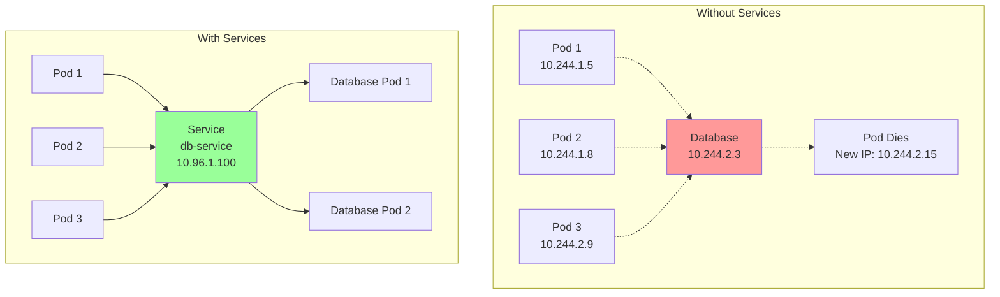
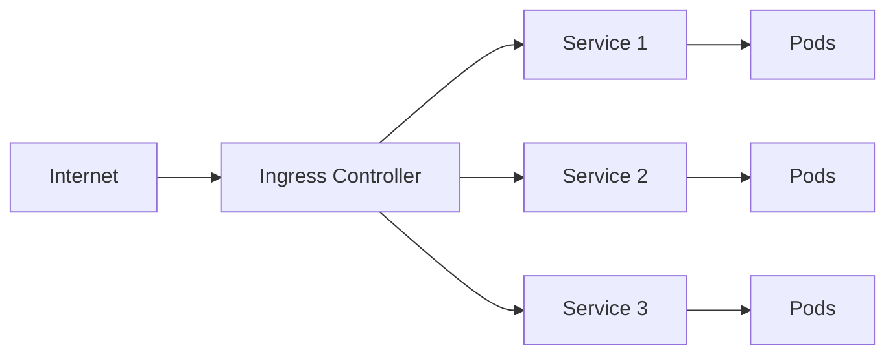

# 03 - Services and Networking 🌐

*Understanding Services, Ingress, and Kubernetes networking concepts*

---

## Table of Contents
- [Kubernetes Networking Overview](#kubernetes-networking-overview)
- [Understanding Services](#understanding-services)
- [Service Types](#service-types)
- [Service Discovery](#service-discovery)
- [Ingress Controllers](#ingress-controllers)
- [Network Policies](#network-policies)
- [DNS in Kubernetes](#dns-in-kubernetes)
- [Advanced Networking](#advanced-networking)
- [Troubleshooting Networking](#troubleshooting-networking)
- [Best Practices](#best-practices)
- [Hands-on Exercises](#hands-on-exercises)

---

## Kubernetes Networking Overview

### Kubernetes Networking Model

Kubernetes follows a **flat network model** where:
- Every pod gets a unique IP address
- Pods can communicate directly without NAT
- Nodes can communicate with pods without NAT
- Services provide stable networking for dynamic pods

```
┌─────────────────────────────────────────────────────┐
│                 Kubernetes Cluster                  │
├─────────────────┬───────────────────────────────────┤
│    Node 1       │            Node 2                 │
│  ┌───────────┐  │  ┌───────────┐  ┌───────────┐     │
│  │Pod        │  │  │Pod        │  │Pod        │     │
│  │10.244.1.5 │◄─┼─►│10.244.2.3 │◄─┼─►│10.244.2.8 │     │
│  └───────────┘  │  └───────────┘  └───────────┘     │
├─────────────────┼───────────────────────────────────┤
│   Service Network (ClusterIP Range)                │
│   10.96.0.0/12                                     │
└─────────────────────────────────────────────────────┘
```

### Four Types of Communication

#### 1. **Container-to-Container** (Same Pod)
- Communication via `localhost`
- Shared network namespace
- Different ports for different containers

#### 2. **Pod-to-Pod** (Same Node)
- Direct IP communication
- No NAT involved
- Container runtime manages networking

#### 3. **Pod-to-Pod** (Different Nodes)
- Routed through cluster network
- CNI plugin handles routing
- Maintains flat network model

#### 4. **External-to-Pod**
- Through Services (ClusterIP, NodePort, LoadBalancer)
- Via Ingress controllers
- Using port forwarding (development)

---

## Understanding Services

### What is a Service?

A **Service** is an abstraction that defines a logical set of pods and provides:
- **Stable networking**: Consistent IP and DNS name
- **Load balancing**: Traffic distribution across healthy pods
- **Service discovery**: DNS-based service location

### Why Services Are Needed



### Service Components

```yaml
apiVersion: v1
kind: Service
metadata:
  name: web-service
spec:
  selector:              # Selects pods to include
    app: web
  ports:                 # Port mappings
  - protocol: TCP
    port: 80             # Service port
    targetPort: 8080     # Container port
  type: ClusterIP        # Service type
```

---

## Service Types

### 1. ClusterIP (Default)

**Purpose**: Internal cluster communication only

```yaml
apiVersion: v1
kind: Service
metadata:
  name: backend-service
spec:
  type: ClusterIP
  selector:
    app: backend
  ports:
  - port: 80
    targetPort: 8080
    protocol: TCP
```

**Characteristics**:
- Only accessible from within cluster
- Gets internal IP from service CIDR
- Used for microservice communication

**Use Cases**:
- Database services
- Internal APIs
- Backend services

### 2. NodePort

**Purpose**: Expose service on each node's IP at a static port

```yaml
apiVersion: v1
kind: Service
metadata:
  name: web-nodeport
spec:
  type: NodePort
  selector:
    app: web
  ports:
  - port: 80
    targetPort: 8080
    nodePort: 30080      # Optional: Auto-assigned if not specified
    protocol: TCP
```

**Characteristics**:
- Accessible via `<NodeIP>:<NodePort>`
- Port range: 30000-32767 (configurable)
- Creates ClusterIP automatically

**Network Flow**:
```
Internet → Node IP:30080 → Service → Pod:8080
```

### 3. LoadBalancer

**Purpose**: Expose service via cloud provider's load balancer

```yaml
apiVersion: v1
kind: Service
metadata:
  name: web-loadbalancer
spec:
  type: LoadBalancer
  selector:
    app: web
  ports:
  - port: 80
    targetPort: 8080
    protocol: TCP
```

**Characteristics**:
- Provisions external load balancer
- Combines ClusterIP and NodePort
- Cloud provider specific

**Supported Platforms**:
- AWS (ELB/ALB/NLB)
- GCP (Cloud Load Balancer)
- Azure (Load Balancer)

### 4. ExternalName

**Purpose**: Maps service to external DNS name

```yaml
apiVersion: v1
kind: Service
metadata:
  name: external-db
spec:
  type: ExternalName
  externalName: db.example.com
  ports:
  - port: 5432
```

**Use Cases**:
- External databases
- Third-party APIs
- Legacy systems migration

### 5. Headless Service

**Purpose**: Direct pod-to-pod communication without load balancing

```yaml
apiVersion: v1
kind: Service
metadata:
  name: headless-service
spec:
  clusterIP: None         # Makes it headless
  selector:
    app: database
  ports:
  - port: 5432
    targetPort: 5432
```

**Characteristics**:
- No cluster IP assigned
- DNS returns pod IPs directly
- Used with StatefulSets

---

## Service Discovery

### DNS-Based Discovery

Kubernetes provides built-in DNS service discovery:

```bash
# Service DNS format
<service-name>.<namespace>.svc.cluster.local

# Examples
web-service.default.svc.cluster.local
database.production.svc.cluster.local
```

### Service Discovery Examples

#### **Same Namespace**
```yaml
# Application connecting to service in same namespace
apiVersion: v1
kind: Pod
metadata:
  name: app-pod
spec:
  containers:
  - name: app
    image: myapp:latest
    env:
    - name: DATABASE_URL
      value: "postgresql://database:5432/mydb"  # Short name works
```

#### **Different Namespace**
```yaml
# Application connecting to service in different namespace
apiVersion: v1
kind: Pod
metadata:
  name: app-pod
  namespace: frontend
spec:
  containers:
  - name: app
    image: myapp:latest
    env:
    - name: API_URL
      value: "http://api-service.backend.svc.cluster.local:80"
```

### Environment Variables

Kubernetes automatically creates environment variables for services:

```bash
# For a service named "database"
DATABASE_SERVICE_HOST=10.96.1.100
DATABASE_SERVICE_PORT=5432
DATABASE_PORT_5432_TCP_ADDR=10.96.1.100
DATABASE_PORT_5432_TCP_PORT=5432
DATABASE_PORT_5432_TCP_PROTO=tcp
```

---

## Ingress Controllers

### What is Ingress?

**Ingress** provides HTTP/HTTPS routing to services based on rules (host, path, headers).



### Ingress vs Service LoadBalancer

| Feature | Ingress | LoadBalancer Service |
|---------|---------|---------------------|
| **Protocol** | HTTP/HTTPS only | Any protocol |
| **Routing** | Path/Host based | Simple load balancing |
| **SSL Termination** | Yes | No (depends on LB) |
| **Cost** | Single LB for multiple services | One LB per service |
| **Features** | Rich (redirects, auth, etc.) | Basic |

### Basic Ingress Example

```yaml
apiVersion: networking.k8s.io/v1
kind: Ingress
metadata:
  name: web-ingress
  annotations:
    nginx.ingress.kubernetes.io/rewrite-target: /
spec:
  rules:
  - host: myapp.example.com
    http:
      paths:
      - path: /
        pathType: Prefix
        backend:
          service:
            name: web-service
            port:
              number: 80
```

### Advanced Ingress Configuration

```yaml
apiVersion: networking.k8s.io/v1
kind: Ingress
metadata:
  name: advanced-ingress
  annotations:
    # NGINX specific annotations
    nginx.ingress.kubernetes.io/ssl-redirect: "true"
    nginx.ingress.kubernetes.io/rate-limit: "100"
    nginx.ingress.kubernetes.io/auth-type: basic
    nginx.ingress.kubernetes.io/auth-secret: basic-auth
    nginx.ingress.kubernetes.io/cors-allow-methods: "GET, POST, OPTIONS"
    nginx.ingress.kubernetes.io/cors-allow-origin: "https://example.com"
spec:
  tls:
  - hosts:
    - myapp.example.com
    - api.example.com
    secretName: tls-secret
  rules:
  - host: myapp.example.com
    http:
      paths:
      - path: /
        pathType: Prefix
        backend:
          service:
            name: frontend-service
            port:
              number: 80
      - path: /api
        pathType: Prefix
        backend:
          service:
            name: api-service
            port:
              number: 8080
  - host: admin.example.com
    http:
      paths:
      - path: /
        pathType: Prefix
        backend:
          service:
            name: admin-service
            port:
              number: 3000
```

### Path Types

| Path Type | Description | Example |
|-----------|-------------|---------|
| **Exact** | Must match exactly | `/api/v1` matches only `/api/v1` |
| **Prefix** | Matches path prefix | `/api` matches `/api/*` |
| **ImplementationSpecific** | Depends on ingress class | Varies by controller |

### Popular Ingress Controllers

#### **NGINX Ingress Controller**
```bash
# Install NGINX Ingress Controller
kubectl apply -f https://raw.githubusercontent.com/kubernetes/ingress-nginx/controller-v1.8.1/deploy/static/provider/cloud/deploy.yaml
```

#### **Traefik**
```bash
# Install Traefik
helm repo add traefik https://traefik.github.io/charts
helm install traefik traefik/traefik
```

#### **AWS ALB Ingress Controller**
```yaml
# For AWS EKS clusters
apiVersion: networking.k8s.io/v1
kind: Ingress
metadata:
  name: aws-ingress
  annotations:
    kubernetes.io/ingress.class: alb
    alb.ingress.kubernetes.io/scheme: internet-facing
    alb.ingress.kubernetes.io/target-type: ip
spec:
  rules:
  - http:
      paths:
      - path: /
        pathType: Prefix
        backend:
          service:
            name: web-service
            port:
              number: 80
```

---

## Network Policies

### What are Network Policies?

**Network Policies** provide network-level security by controlling traffic flow between pods.

> **Note**: Requires a CNI plugin that supports network policies (Calico, Cilium, Weave Net)

### Default Behavior

```yaml
# Without Network Policies
┌─────────┐    ┌─────────┐    ┌─────────┐
│  Pod A  │◄──►│  Pod B  │◄──►│  Pod C  │
└─────────┘    └─────────┘    └─────────┘
     ▲              ▲              ▲
     └──────────────┼──────────────┘
              All traffic allowed
```

### Deny-All Network Policy

```yaml
apiVersion: networking.k8s.io/v1
kind: NetworkPolicy
metadata:
  name: deny-all
spec:
  podSelector: {}    # Selects all pods
  policyTypes:
  - Ingress
  - Egress
  # No ingress/egress rules = deny all
```

### Allow Specific Traffic

```yaml
apiVersion: networking.k8s.io/v1
kind: NetworkPolicy
metadata:
  name: web-netpol
spec:
  podSelector:
    matchLabels:
      app: web
  policyTypes:
  - Ingress
  - Egress
  ingress:
  - from:
    - podSelector:
        matchLabels:
          app: frontend
    - namespaceSelector:
        matchLabels:
          name: production
    ports:
    - protocol: TCP
      port: 8080
  egress:
  - to:
    - podSelector:
        matchLabels:
          app: database
    ports:
    - protocol: TCP
      port: 5432
  - to: []  # Allow DNS
    ports:
    - protocol: UDP
      port: 53
```

### Network Policy Examples

#### **Database Access Control**
```yaml
apiVersion: networking.k8s.io/v1
kind: NetworkPolicy
metadata:
  name: database-netpol
spec:
  podSelector:
    matchLabels:
      app: database
  policyTypes:
  - Ingress
  ingress:
  - from:
    - podSelector:
        matchLabels:
          role: backend
    ports:
    - protocol: TCP
      port: 5432
```

#### **Namespace Isolation**
```yaml
apiVersion: networking.k8s.io/v1
kind: NetworkPolicy
metadata:
  name: namespace-isolation
  namespace: production
spec:
  podSelector: {}
  policyTypes:
  - Ingress
  ingress:
  - from:
    - namespaceSelector:
        matchLabels:
          name: production
```

---

## DNS in Kubernetes

### CoreDNS

Kubernetes uses **CoreDNS** for service discovery and DNS resolution.

```yaml
# CoreDNS ConfigMap
apiVersion: v1
kind: ConfigMap
metadata:
  name: coredns
  namespace: kube-system
data:
  Corefile: |
    .:53 {
        errors
        health {
           lameduck 5s
        }
        ready
        kubernetes cluster.local in-addr.arpa ip6.arpa {
           pods insecure
           fallthrough in-addr.arpa ip6.arpa
           ttl 30
        }
        prometheus :9153
        forward . /etc/resolv.conf {
           max_concurrent 1000
        }
        cache 30
        loop
        reload
        loadbalance
    }
```

### DNS Records

#### **Service Records**
```bash
# A Record (IPv4)
web-service.default.svc.cluster.local → 10.96.1.100

# AAAA Record (IPv6)
web-service.default.svc.cluster.local → fd00::10:96:1:100

# SRV Record (Service)
_http._tcp.web-service.default.svc.cluster.local → web-service.default.svc.cluster.local:80
```

#### **Pod Records** (if enabled)
```bash
# Pod A Record
10-244-1-5.default.pod.cluster.local → 10.244.1.5

# Pod with hostname/subdomain
pod-name.headless-service.default.svc.cluster.local
```

### Custom DNS Configuration

```yaml
apiVersion: v1
kind: Pod
metadata:
  name: custom-dns-pod
spec:
  dnsPolicy: "None"
  dnsConfig:
    nameservers:
      - 8.8.8.8
      - 8.8.4.4
    searches:
      - mycompany.com
    options:
      - name: ndots
        value: "2"
  containers:
  - name: app
    image: busybox
    command: ['sleep', '3600']
```

### DNS Policies

| DNS Policy | Description |
|------------|-------------|
| **Default** | Inherit DNS from node |
| **ClusterFirst** | Use cluster DNS first, then upstream |
| **ClusterFirstWithHostNet** | For pods using hostNetwork |
| **None** | Use dnsConfig only |

---

## Advanced Networking

### Container Network Interface (CNI)

Popular CNI plugins:

#### **Calico**
- Layer 3 networking
- Network policies support
- BGP routing

#### **Flannel**
- Simple overlay network
- VXLAN backend
- Easy setup

#### **Weave Net**
- Mesh networking
- Network policies
- Encryption support

#### **Cilium**
- eBPF-based
- Advanced security
- Service mesh features

### Service Mesh Integration

#### **Istio**
```yaml
apiVersion: v1
kind: Service
metadata:
  name: productpage
  annotations:
    service.beta.kubernetes.io/aws-load-balancer-type: nlb
spec:
  selector:
    app: productpage
  ports:
  - port: 9080
    name: http
```

#### **Linkerd**
```yaml
apiVersion: apps/v1
kind: Deployment
metadata:
  name: web
  annotations:
    linkerd.io/inject: enabled
spec:
  replicas: 3
  selector:
    matchLabels:
      app: web
  template:
    metadata:
      labels:
        app: web
    spec:
      containers:
      - name: web
        image: nginx:1.21
```

---

## Troubleshooting Networking

### Common Issues and Solutions

#### **Pod Cannot Reach Service**

```bash
# 1. Check service endpoints
kubectl get endpoints <service-name>

# 2. Verify pod labels match service selector
kubectl describe service <service-name>
kubectl get pods --show-labels

# 3. Check if pods are ready
kubectl get pods -o wide

# 4. Test DNS resolution
kubectl exec -it <pod-name> -- nslookup <service-name>
```

#### **Service Not Accessible from Outside**

```bash
# 1. Check service type and ports
kubectl describe service <service-name>

# 2. For NodePort, verify node firewall
# Check if nodePort is accessible
curl <node-ip>:<node-port>

# 3. For LoadBalancer, check external IP
kubectl get service <service-name>

# 4. Verify ingress configuration
kubectl describe ingress <ingress-name>
kubectl get ingress
```

#### **Network Policy Blocking Traffic**

```bash
# 1. List network policies
kubectl get networkpolicies

# 2. Describe network policy
kubectl describe networkpolicy <policy-name>

# 3. Check pod labels
kubectl get pods --show-labels

# 4. Temporarily disable network policy
kubectl delete networkpolicy <policy-name>
```

### Debugging Tools

#### **Network Test Pod**
```yaml
apiVersion: v1
kind: Pod
metadata:
  name: netshoot
spec:
  containers:
  - name: netshoot
    image: nicolaka/netshoot
    command: ['sleep', '3600']
```

```bash
# Use netshoot for network debugging
kubectl exec -it netshoot -- bash

# Inside the pod:
nslookup kubernetes.default
curl -v http://web-service:80
ping 10.96.1.100
traceroute google.com
```

#### **DNS Debugging**
```bash
# Check DNS resolution
kubectl exec -it <pod-name> -- nslookup kubernetes.default

# Check CoreDNS logs
kubectl logs -n kube-system -l k8s-app=kube-dns

# Test specific service
kubectl exec -it <pod-name> -- nslookup <service-name>.<namespace>.svc.cluster.local
```

---

## Best Practices

### 1. **Service Design**

```yaml
# Good: Descriptive service names
apiVersion: v1
kind: Service
metadata:
  name: user-authentication-api
  labels:
    app: user-auth
    component: api
    version: v2.1
spec:
  selector:
    app: user-auth
    component: api
  ports:
  - name: http-api
    port: 80
    targetPort: 8080
  - name: metrics
    port: 9090
    targetPort: 9090
```

### 2. **Health Checks Integration**

```yaml
apiVersion: v1
kind: Service
metadata:
  name: web-service
spec:
  selector:
    app: web
  ports:
  - port: 80
    targetPort: 8080
---
apiVersion: apps/v1
kind: Deployment
metadata:
  name: web-deployment
spec:
  selector:
    matchLabels:
      app: web
  template:
    metadata:
      labels:
        app: web
    spec:
      containers:
      - name: web
        image: nginx:1.21
        ports:
        - containerPort: 8080
        readinessProbe:
          httpGet:
            path: /health
            port: 8080
          initialDelaySeconds: 10
          periodSeconds: 5
```

### 3. **Security Best Practices**

```yaml
# Implement least-privilege network policies
apiVersion: networking.k8s.io/v1
kind: NetworkPolicy
metadata:
  name: web-tier-policy
spec:
  podSelector:
    matchLabels:
      tier: web
  policyTypes:
  - Ingress
  - Egress
  ingress:
  - from:
    - namespaceSelector:
        matchLabels:
          name: frontend
    ports:
    - protocol: TCP
      port: 80
  egress:
  - to:
    - podSelector:
        matchLabels:
          tier: api
    ports:
    - protocol: TCP
      port: 8080
  # Allow DNS
  - to: []
    ports:
    - protocol: UDP
      port: 53
```

### 4. **Ingress Best Practices**

```yaml
apiVersion: networking.k8s.io/v1
kind: Ingress
metadata:
  name: production-ingress
  annotations:
    # Security headers
    nginx.ingress.kubernetes.io/server-snippet: |
      add_header X-Frame-Options "SAMEORIGIN" always;
      add_header X-Content-Type-Options "nosniff" always;
      add_header X-XSS-Protection "1; mode=block" always;
    
    # Rate limiting
    nginx.ingress.kubernetes.io/rate-limit: "100"
    nginx.ingress.kubernetes.io/rate-limit-window: "1m"
    
    # SSL configuration
    nginx.ingress.kubernetes.io/ssl-protocols: "TLSv1.2 TLSv1.3"
    nginx.ingress.kubernetes.io/ssl-ciphers: "ECDHE-ECDSA-AES128-GCM-SHA256,ECDHE-RSA-AES128-GCM-SHA256"
spec:
  tls:
  - hosts:
    - api.example.com
    secretName: api-tls-secret
  rules:
  - host: api.example.com
    http:
      paths:
      - path: /
        pathType: Prefix
        backend:
          service:
            name: api-service
            port:
              number: 80
```

---

## Hands-on Exercises

### Exercise 1: Basic Service Creation

```yaml
# Create file: web-app-exercise.yaml
apiVersion: apps/v1
kind: Deployment
metadata:
  name: web-app
spec:
  replicas: 3
  selector:
    matchLabels:
      app: web
  template:
    metadata:
      labels:
        app: web
    spec:
      containers:
      - name: nginx
        image: nginx:1.21
        ports:
        - containerPort: 80
---
apiVersion: v1
kind: Service
metadata:
  name: web-service
spec:
  selector:
    app: web
  ports:
  - port: 80
    targetPort: 80
  type: ClusterIP
```

**Tasks:**
```bash
# 1. Deploy the application
kubectl apply -f web-app-exercise.yaml

# 2. Check service and endpoints
kubectl get service web-service
kubectl get endpoints web-service
kubectl describe service web-service

# 3. Test service from within cluster
kubectl run test-pod --image=curlimages/curl -it --rm -- sh
# Inside the pod:
curl web-service

# 4. Test different service types
kubectl patch service web-service -p '{"spec":{"type":"NodePort"}}'
kubectl get service web-service

# 5. Clean up
kubectl delete -f web-app-exercise.yaml
```

### Exercise 2: Multi-Service Application

```yaml
# Create file: multi-service-app.yaml
apiVersion: apps/v1
kind: Deployment
metadata:
  name: frontend
spec:
  replicas: 2
  selector:
    matchLabels:
      app: frontend
  template:
    metadata:
      labels:
        app: frontend
    spec:
      containers:
      - name: nginx
        image: nginx:1.21
        ports:
        - containerPort: 80
---
apiVersion: v1
kind: Service
metadata:
  name: frontend-service
spec:
  selector:
    app: frontend
  ports:
  - port: 80
    targetPort: 80
  type: NodePort
---
apiVersion: apps/v1
kind: Deployment
metadata:
  name: backend
spec:
  replicas: 2
  selector:
    matchLabels:
      app: backend
  template:
    metadata:
      labels:
        app: backend
    spec:
      containers:
      - name: api
        image: httpd:2.4
        ports:
        - containerPort: 80
---
apiVersion: v1
kind: Service
metadata:
  name: backend-service
spec:
  selector:
    app: backend
  ports:
  - port: 8080
    targetPort: 80
  type: ClusterIP
```

**Tasks:**
```bash
# 1. Deploy multi-service application
kubectl apply -f multi-service-app.yaml

# 2. Check all services
kubectl get services
kubectl get endpoints

# 3. Test inter-service communication
kubectl exec deployment/frontend -- curl backend-service:8080

# 4. Test external access (NodePort)
kubectl get service frontend-service
# Access via http://<node-ip>:<node-port>

# 5. Clean up
kubectl delete -f multi-service-app.yaml
```

### Exercise 3: Ingress Configuration

```yaml
# Create file: ingress-exercise.yaml
apiVersion: apps/v1
kind: Deployment
metadata:
  name: app1
spec:
  replicas: 2
  selector:
    matchLabels:
      app: app1
  template:
    metadata:
      labels:
        app: app1
    spec:
      containers:
      - name: nginx
        image: nginx:1.21
        ports:
        - containerPort: 80
        volumeMounts:
        - name: html
          mountPath: /usr/share/nginx/html
      volumes:
      - name: html
        configMap:
          name: app1-html
---
apiVersion: v1
kind: ConfigMap
metadata:
  name: app1-html
data:
  index.html: |
    <h1>Application 1</h1>
    <p>This is app1 service</p>
---
apiVersion: v1
kind: Service
metadata:
  name: app1-service
spec:
  selector:
    app: app1
  ports:
  - port: 80
    targetPort: 80
---
apiVersion: apps/v1
kind: Deployment
metadata:
  name: app2
spec:
  replicas: 2
  selector:
    matchLabels:
      app: app2
  template:
    metadata:
      labels:
        app: app2
    spec:
      containers:
      - name: nginx
        image: nginx:1.21
        ports:
        - containerPort: 80
        volumeMounts:
        - name: html
          mountPath: /usr/share/nginx/html
      volumes:
      - name: html
        configMap:
          name: app2-html
---
apiVersion: v1
kind: ConfigMap
metadata:
  name: app2-html
data:
  index.html: |
    <h1>Application 2</h1>
    <p>This is app2 service</p>
---
apiVersion: v1
kind: Service
metadata:
  name: app2-service
spec:
  selector:
    app: app2
  ports:
  - port: 80
    targetPort: 80
---
apiVersion: networking.k8s.io/v1
kind: Ingress
metadata:
  name: app-ingress
  annotations:
    nginx.ingress.kubernetes.io/rewrite-target: /
spec:
  rules:
  - host: myapps.local
    http:
      paths:
      - path: /app1
        pathType: Prefix
        backend:
          service:
            name: app1-service
            port:
              number: 80
      - path: /app2
        pathType: Prefix
        backend:
          service:
            name: app2-service
            port:
              number: 80
```

**Tasks:**
```bash
# 1. Install NGINX Ingress Controller (if not installed)
kubectl apply -f https://raw.githubusercontent.com/kubernetes/ingress-nginx/controller-v1.8.1/deploy/static/provider/cloud/deploy.yaml

# 2. Deploy applications and ingress
kubectl apply -f ingress-exercise.yaml

# 3. Check ingress status
kubectl get ingress app-ingress
kubectl describe ingress app-ingress

# 4. Test ingress routing (add to /etc/hosts if needed)
# Add: <ingress-ip> myapps.local
curl http://myapps.local/app1
curl http://myapps.local/app2

# 5. Clean up
kubectl delete -f ingress-exercise.yaml
```

### Exercise 4: Network Policies

```yaml
# Create file: network-policy-exercise.yaml
apiVersion: v1
kind: Namespace
metadata:
  name: secure-app
---
apiVersion: apps/v1
kind: Deployment
metadata:
  name: web-app
  namespace: secure-app
spec:
  replicas: 2
  selector:
    matchLabels:
      app: web
      tier: frontend
  template:
    metadata:
      labels:
        app: web
        tier: frontend
    spec:
      containers:
      - name: nginx
        image: nginx:1.21
        ports:
        - containerPort: 80
---
apiVersion: v1
kind: Service
metadata:
  name: web-service
  namespace: secure-app
spec:
  selector:
    app: web
    tier: frontend
  ports:
  - port: 80
    targetPort: 80
---
apiVersion: apps/v1
kind: Deployment
metadata:
  name: database
  namespace: secure-app
spec:
  replicas: 1
  selector:
    matchLabels:
      app: database
      tier: data
  template:
    metadata:
      labels:
        app: database
        tier: data
    spec:
      containers:
      - name: mysql
        image: mysql:8.0
        env:
        - name: MYSQL_ROOT_PASSWORD
          value: "rootpass"
        ports:
        - containerPort: 3306
---
apiVersion: v1
kind: Service
metadata:
  name: database-service
  namespace: secure-app
spec:
  selector:
    app: database
    tier: data
  ports:
  - port: 3306
    targetPort: 3306
---
# Deny all traffic by default
apiVersion: networking.k8s.io/v1
kind: NetworkPolicy
metadata:
  name: default-deny-all
  namespace: secure-app
spec:
  podSelector: {}
  policyTypes:
  - Ingress
  - Egress
---
# Allow web tier to access database
apiVersion: networking.k8s.io/v1
kind: NetworkPolicy
metadata:
  name: web-to-database
  namespace: secure-app
spec:
  podSelector:
    matchLabels:
      app: database
      tier: data
  policyTypes:
  - Ingress
  ingress:
  - from:
    - podSelector:
        matchLabels:
          app: web
          tier: frontend
    ports:
    - protocol: TCP
      port: 3306
---
# Allow external traffic to web tier
apiVersion: networking.k8s.io/v1
kind: NetworkPolicy
metadata:
  name: allow-web-ingress
  namespace: secure-app
spec:
  podSelector:
    matchLabels:
      app: web
      tier: frontend
  policyTypes:
  - Ingress
  ingress:
  - ports:
    - protocol: TCP
      port: 80
---
# Allow DNS resolution
apiVersion: networking.k8s.io/v1
kind: NetworkPolicy
metadata:
  name: allow-dns
  namespace: secure-app
spec:
  podSelector: {}
  policyTypes:
  - Egress
  egress:
  - to: []
    ports:
    - protocol: UDP
      port: 53
```

**Tasks:**
```bash
# 1. Deploy secure application
kubectl apply -f network-policy-exercise.yaml

# 2. Test connectivity without network policies
kubectl delete networkpolicy --all -n secure-app
kubectl exec -n secure-app deployment/web-app -- curl database-service:3306

# 3. Apply network policies
kubectl apply -f network-policy-exercise.yaml

# 4. Test that policies are working
kubectl get networkpolicies -n secure-app

# 5. Test allowed connectivity
kubectl exec -n secure-app deployment/web-app -- nc -zv database-service 3306

# 6. Try to access from different namespace (should fail)
kubectl run test-pod --image=busybox -it --rm -- sh
# Inside the pod:
nc -zv database-service.secure-app.svc.cluster.local 3306

# 7. Clean up
kubectl delete namespace secure-app
```

---

## Key Takeaways

### Service Types Understanding ✅
- **ClusterIP**: Internal cluster communication
- **NodePort**: External access via node ports (30000-32767)
- **LoadBalancer**: Cloud provider load balancer integration
- **ExternalName**: DNS CNAME mapping
- **Headless**: Direct pod-to-pod communication

### Ingress Mastery ✅
- HTTP/HTTPS routing based on host/path rules
- SSL termination and certificate management
- Advanced features like rate limiting, authentication
- Multiple ingress controllers available (NGINX, Traefik, etc.)

### Network Security ✅
- Network policies provide micro-segmentation
- Default deny-all approach for maximum security
- Label selectors for fine-grained control
- Requires CNI plugin support

### Service Discovery ✅
- DNS-based service discovery built-in
- Services accessible via DNS names
- Environment variables automatically created
- Cross-namespace communication supported

---

## Next Steps

Now that you understand services and networking, proceed to:
- **[04-storage-volumes.md](./04-storage-volumes.md)**: Learn about Persistent Volumes and Storage
- Practice creating different service types
- Experiment with ingress configurations  
- Implement network policies for security

---

## Common Troubleshooting Commands

```bash
# Service debugging
kubectl get services
kubectl get endpoints <service-name>
kubectl describe service <service-name>

# Network debugging
kubectl exec -it <pod> -- nslookup <service>
kubectl exec -it <pod> -- curl <service>:<port>
kubectl logs -n kube-system -l k8s-app=kube-dns

# Ingress debugging
kubectl get ingress
kubectl describe ingress <ingress-name>
kubectl logs -n ingress-nginx -l app.kubernetes.io/name=ingress-nginx

# Network policy debugging
kubectl get networkpolicies
kubectl describe networkpolicy <policy-name>
```

---

**Next**: [04 - Storage and Volumes →](./04-storage-volumes.md)
