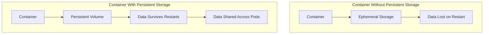
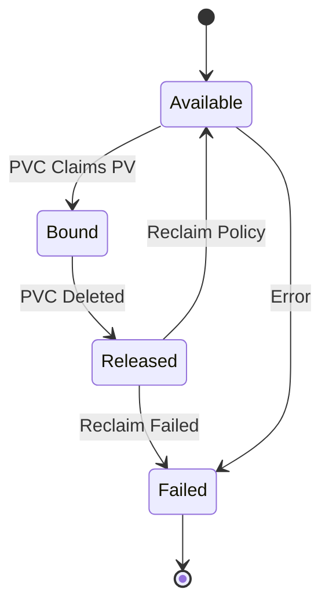
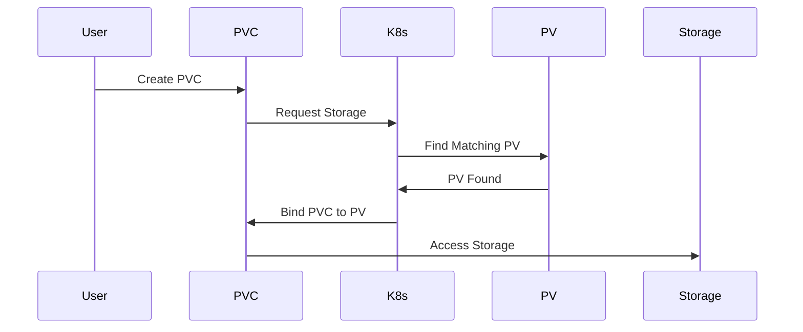
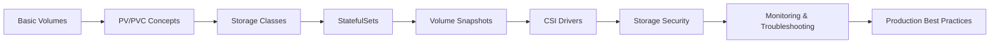

# 04 - Kubernetes Storage and Volumes 💾

*Mastering persistent storage, volumes, and data management in Kubernetes*

---

## Table of Contents
- [Understanding Kubernetes Storage](#understanding-kubernetes-storage)
- [Volume Types Overview](#volume-types-overview)
- [Persistent Volumes (PV)](#persistent-volumes-pv)
- [Persistent Volume Claims (PVC)](#persistent-volume-claims-pvc)
- [Storage Classes](#storage-classes)
- [StatefulSets and Storage](#statefulsets-and-storage)
- [Volume Snapshots](#volume-snapshots)
- [Storage Security](#storage-security)
- [Best Practices](#best-practices)
- [Cloud Provider Storage](#cloud-provider-storage)
- [Troubleshooting Storage](#troubleshooting-storage)
- [Hands-on Exercises](#hands-on-exercises)

---

## Understanding Kubernetes Storage

### Storage Challenges in Containerized Applications



### Key Storage Concepts

#### **Ephemeral vs Persistent Storage**

| Ephemeral Storage | Persistent Storage |
|-------------------|-------------------|
| Lives with container | Survives container restarts |
| Lost on pod deletion | Independent lifecycle |
| Fast access | May have network latency |
| Limited size | Configurable size |
| No sharing between pods | Can be shared |

### Storage Architecture

```
┌─────────────────────────────────────────────────────┐
│                 Kubernetes Cluster                  │
├─────────────────────────────────────────────────────┤
│  Pod → PVC → PV → Storage Class → Physical Storage  │
├─────────────────────────────────────────────────────┤
│                                                     │
│  ┌─────────┐    ┌─────┐    ┌────┐    ┌──────────┐   │
│  │   Pod   │───►│ PVC │───►│ PV │───►│ Storage  │   │
│  │         │    │     │    │    │    │  Backend │   │
│  └─────────┘    └─────┘    └────┘    └──────────┘   │
│                                                     │
└─────────────────────────────────────────────────────┘
```

---

## Volume Types Overview

### Temporary Volumes

#### 1. **emptyDir**
- Temporary storage that lives with the pod
- Shared between containers in the same pod
- Deleted when pod is removed

```yaml
apiVersion: v1
kind: Pod
metadata:
  name: emptydir-pod
spec:
  containers:
  - name: web-server
    image: nginx:1.21
    volumeMounts:
    - name: shared-data
      mountPath: /usr/share/nginx/html
  - name: content-generator
    image: busybox
    command:
    - /bin/sh
    - -c
    - |
      while true; do
        echo "<h1>Hello from $(hostname)</h1><p>Time: $(date)</p>" > /shared/index.html
        sleep 60
      done
    volumeMounts:
    - name: shared-data
      mountPath: /shared
  volumes:
  - name: shared-data
    emptyDir: {}
```

#### 2. **hostPath**
- Mounts file/directory from host node
- Useful for accessing node-level resources
- **Warning**: Not portable across nodes

```yaml
apiVersion: v1
kind: Pod
metadata:
  name: hostpath-pod
spec:
  containers:
  - name: log-reader
    image: busybox
    command: ['tail', '-f', '/host-logs/syslog']
    volumeMounts:
    - name: host-logs
      mountPath: /host-logs
      readOnly: true
  volumes:
  - name: host-logs
    hostPath:
      path: /var/log
      type: Directory
```

### ConfigMap and Secret Volumes

#### **ConfigMap Volume**
```yaml
apiVersion: v1
kind: ConfigMap
metadata:
  name: app-config
data:
  app.properties: |
    database.url=jdbc:postgresql://db:5432/myapp
    database.username=appuser
    log.level=INFO
  nginx.conf: |
    server {
        listen 80;
        location / {
            proxy_pass http://backend:8080;
        }
    }
---
apiVersion: v1
kind: Pod
metadata:
  name: config-pod
spec:
  containers:
  - name: app
    image: myapp:latest
    volumeMounts:
    - name: config-volume
      mountPath: /etc/config
    - name: nginx-config
      mountPath: /etc/nginx/nginx.conf
      subPath: nginx.conf
  volumes:
  - name: config-volume
    configMap:
      name: app-config
  - name: nginx-config
    configMap:
      name: app-config
```

#### **Secret Volume**
```yaml
apiVersion: v1
kind: Secret
metadata:
  name: db-secret
type: Opaque
data:
  username: YWRtaW4=  # base64 encoded 'admin'
  password: MWYyZDFlMmU2N2Rm  # base64 encoded password
---
apiVersion: v1
kind: Pod
metadata:
  name: secret-pod
spec:
  containers:
  - name: app
    image: postgres:13
    env:
    - name: POSTGRES_USER
      valueFrom:
        secretKeyRef:
          name: db-secret
          key: username
    volumeMounts:
    - name: secret-volume
      mountPath: /etc/secrets
      readOnly: true
  volumes:
  - name: secret-volume
    secret:
      secretName: db-secret
      defaultMode: 0400  # Read-only for owner
```

---

## Persistent Volumes (PV)

### What is a Persistent Volume?

A **Persistent Volume (PV)** is a piece of storage in the cluster that:
- Has been provisioned by an administrator or dynamically created
- Has a lifecycle independent of any pod
- Abstracts details of storage implementation
- Can be consumed by pods through PVCs

### PV Lifecycle



### PV Reclaim Policies

| Policy | Description | Use Case |
|--------|-------------|----------|
| **Retain** | Manual cleanup required | Production data |
| **Delete** | PV and storage deleted | Development |
| **Recycle** | Basic scrub (deprecated) | Legacy systems |

### Complete PV Example

```yaml
apiVersion: v1
kind: PersistentVolume
metadata:
  name: mysql-pv
  labels:
    type: local
    app: mysql
spec:
  capacity:
    storage: 10Gi
  accessModes:
    - ReadWriteOnce
  persistentVolumeReclaimPolicy: Retain
  storageClassName: manual
  hostPath:
    path: /opt/mysql-data
    type: DirectoryOrCreate
  nodeAffinity:
    required:
      nodeSelectorTerms:
      - matchExpressions:
        - key: kubernetes.io/hostname
          operator: In
          values:
          - worker-node-1
```

### Access Modes

| Access Mode | Description | Abbreviation |
|-------------|-------------|--------------|
| **ReadWriteOnce** | Mount as read-write by single node | RWO |
| **ReadOnlyMany** | Mount as read-only by many nodes | ROX |
| **ReadWriteMany** | Mount as read-write by many nodes | RWX |
| **ReadWriteOncePod** | Mount as read-write by single pod | RWOP |

### PV Phases

```bash
# Check PV status
kubectl get pv

# Example output:
NAME       CAPACITY   ACCESS MODES   RECLAIM POLICY   STATUS    CLAIM     STORAGECLASS   AGE
mysql-pv   10Gi       RWO            Retain           Available                     5m
```

**Status Values:**
- **Available**: Ready for claim
- **Bound**: Bound to a PVC
- **Released**: PVC deleted, but not yet reclaimed
- **Failed**: Automatic reclamation failed

---

## Persistent Volume Claims (PVC)

### What is a PVC?

A **Persistent Volume Claim (PVC)** is a request for storage by a user that:
- Requests specific size and access modes
- Can specify storage class
- Binds to suitable PV automatically
- Acts as a "voucher" for storage consumption

### PVC Example

```yaml
apiVersion: v1
kind: PersistentVolumeClaim
metadata:
  name: mysql-pvc
  labels:
    app: mysql
spec:
  accessModes:
    - ReadWriteOnce
  resources:
    requests:
      storage: 5Gi
  storageClassName: manual
  selector:
    matchLabels:
      app: mysql
```

### Using PVC in Pods

```yaml
apiVersion: apps/v1
kind: Deployment
metadata:
  name: mysql
spec:
  replicas: 1
  selector:
    matchLabels:
      app: mysql
  template:
    metadata:
      labels:
        app: mysql
    spec:
      containers:
      - name: mysql
        image: mysql:8.0
        env:
        - name: MYSQL_ROOT_PASSWORD
          valueFrom:
            secretKeyRef:
              name: mysql-secret
              key: password
        ports:
        - containerPort: 3306
        volumeMounts:
        - name: mysql-storage
          mountPath: /var/lib/mysql
        resources:
          requests:
            memory: "512Mi"
            cpu: "500m"
          limits:
            memory: "1Gi"
            cpu: "1"
      volumes:
      - name: mysql-storage
        persistentVolumeClaim:
          claimName: mysql-pvc
```

### PVC Binding Process



---

## Storage Classes

### What are Storage Classes?

**Storage Classes** provide a way to describe different "classes" of storage that:
- Enable dynamic provisioning
- Define storage provider and parameters
- Allow administrators to offer different storage tiers
- Eliminate need for pre-creating PVs

### Storage Class Example

```yaml
apiVersion: storage.k8s.io/v1
kind: StorageClass
metadata:
  name: fast-ssd
provisioner: kubernetes.io/aws-ebs
parameters:
  type: gp3
  iops: "3000"
  throughput: "125"
  encrypted: "true"
reclaimPolicy: Delete
allowVolumeExpansion: true
volumeBindingMode: WaitForFirstConsumer
mountOptions:
  - debug
  - noatime
```

### Common Provisioners

| Cloud Provider | Provisioner | Storage Type |
|----------------|-------------|--------------|
| **AWS** | `kubernetes.io/aws-ebs` | EBS Volumes |
| **GCP** | `kubernetes.io/gce-pd` | Persistent Disks |
| **Azure** | `kubernetes.io/azure-disk` | Azure Disks |
| **Local** | `kubernetes.io/no-provisioner` | Local Storage |
| **NFS** | `nfs.csi.k8s.io` | NFS Shares |

### Dynamic Provisioning Example

```yaml
apiVersion: storage.k8s.io/v1
kind: StorageClass
metadata:
  name: aws-gp3
  annotations:
    storageclass.kubernetes.io/is-default-class: "true"
provisioner: ebs.csi.aws.com
parameters:
  csi.storage.k8s.io/fstype: ext4
  type: gp3
  iops: "3000"
  throughput: "125"
reclaimPolicy: Delete
allowVolumeExpansion: true
volumeBindingMode: WaitForFirstConsumer
---
apiVersion: v1
kind: PersistentVolumeClaim
metadata:
  name: dynamic-pvc
spec:
  accessModes:
    - ReadWriteOnce
  resources:
    requests:
      storage: 20Gi
  storageClassName: aws-gp3
```

### Volume Binding Modes

| Mode | Description | When to Use |
|------|-------------|-------------|
| **Immediate** | Bind immediately when PVC created | Single AZ deployments |
| **WaitForFirstConsumer** | Wait until pod scheduled | Multi-AZ, topology awareness |

---

## StatefulSets and Storage

### StatefulSets Storage Features

```yaml
apiVersion: apps/v1
kind: StatefulSet
metadata:
  name: mysql-cluster
spec:
  serviceName: mysql
  replicas: 3
  selector:
    matchLabels:
      app: mysql
  template:
    metadata:
      labels:
        app: mysql
    spec:
      containers:
      - name: mysql
        image: mysql:8.0
        ports:
        - containerPort: 3306
        env:
        - name: MYSQL_ROOT_PASSWORD
          valueFrom:
            secretKeyRef:
              name: mysql-secret
              key: password
        volumeMounts:
        - name: mysql-data
          mountPath: /var/lib/mysql
        - name: mysql-config
          mountPath: /etc/mysql/conf.d
      volumes:
      - name: mysql-config
        configMap:
          name: mysql-config
  volumeClaimTemplates:
  - metadata:
      name: mysql-data
    spec:
      accessModes: ["ReadWriteOnce"]
      storageClassName: fast-ssd
      resources:
        requests:
          storage: 10Gi
```

### StatefulSet Storage Characteristics

- **Stable Storage**: Each pod gets persistent storage
- **Ordered Provisioning**: Storage created in order (0, 1, 2...)
- **Pod Identity**: Storage tied to pod identity
- **Persistent**: Storage survives pod rescheduling

### StatefulSet vs Deployment Storage

| Aspect | StatefulSet | Deployment |
|--------|-------------|------------|
| **Pod Identity** | Stable (mysql-0, mysql-1) | Random |
| **Storage** | Per-pod persistent | Shared or ephemeral |
| **Scaling** | Ordered | Parallel |
| **Use Cases** | Databases, message queues | Stateless applications |

---

## Volume Snapshots

### What are Volume Snapshots?

Volume Snapshots provide:
- Point-in-time copies of volumes
- Backup and restore capabilities
- Data protection and disaster recovery
- Clone volumes for testing

### Volume Snapshot Class

```yaml
apiVersion: snapshot.storage.k8s.io/v1
kind: VolumeSnapshotClass
metadata:
  name: ebs-snapshot-class
driver: ebs.csi.aws.com
deletionPolicy: Delete
parameters:
  encrypted: "true"
```

### Creating Volume Snapshots

```yaml
apiVersion: snapshot.storage.k8s.io/v1
kind: VolumeSnapshot
metadata:
  name: mysql-snapshot
spec:
  volumeSnapshotClassName: ebs-snapshot-class
  source:
    persistentVolumeClaimName: mysql-pvc
```

### Restoring from Snapshot

```yaml
apiVersion: v1
kind: PersistentVolumeClaim
metadata:
  name: mysql-restore-pvc
spec:
  accessModes:
    - ReadWriteOnce
  resources:
    requests:
      storage: 10Gi
  storageClassName: aws-gp3
  dataSource:
    name: mysql-snapshot
    kind: VolumeSnapshot
    apiGroup: snapshot.storage.k8s.io
```

---

## Storage Security

### Security Considerations

#### 1. **Access Control**

```yaml
apiVersion: v1
kind: Pod
metadata:
  name: secure-storage-pod
spec:
  securityContext:
    runAsUser: 1000
    runAsGroup: 1000
    fsGroup: 2000
  containers:
  - name: app
    image: nginx:1.21
    securityContext:
      allowPrivilegeEscalation: false
      readOnlyRootFilesystem: true
      runAsNonRoot: true
    volumeMounts:
    - name: data-volume
      mountPath: /data
    - name: tmp-volume
      mountPath: /tmp
  volumes:
  - name: data-volume
    persistentVolumeClaim:
      claimName: secure-pvc
  - name: tmp-volume
    emptyDir: {}
```

#### 2. **Encryption at Rest**

```yaml
apiVersion: storage.k8s.io/v1
kind: StorageClass
metadata:
  name: encrypted-storage
provisioner: ebs.csi.aws.com
parameters:
  type: gp3
  encrypted: "true"
  kmsKeyId: "arn:aws:kms:us-west-2:123456789012:key/12345678-1234-1234-1234-123456789012"
reclaimPolicy: Delete
allowVolumeExpansion: true
```

#### 3. **Network Policies for Storage**

```yaml
apiVersion: networking.k8s.io/v1
kind: NetworkPolicy
metadata:
  name: database-storage-policy
spec:
  podSelector:
    matchLabels:
      app: database
  policyTypes:
  - Ingress
  - Egress
  ingress:
  - from:
    - podSelector:
        matchLabels:
          role: backend
    ports:
    - protocol: TCP
      port: 5432
  egress:
  - to:
    - namespaceSelector:
        matchLabels:
          name: kube-system
    ports:
    - protocol: TCP
      port: 443  # For CSI driver communication
```

---

## Best Practices

### 1. **Resource Management**

```yaml
apiVersion: v1
kind: PersistentVolumeClaim
metadata:
  name: best-practice-pvc
  annotations:
    volume.kubernetes.io/storage-class: fast-ssd
spec:
  accessModes:
    - ReadWriteOnce
  resources:
    requests:
      storage: 10Gi
    limits:  # Some CSI drivers support limits
      storage: 20Gi
  storageClassName: fast-ssd
```

### 2. **Monitoring and Alerts**

```yaml
# Monitor PVC usage
apiVersion: monitoring.coreos.com/v1
kind: PrometheusRule
metadata:
  name: storage-alerts
spec:
  groups:
  - name: storage.rules
    rules:
    - alert: PVCStorageUsageHigh
      expr: |
        (
          kubelet_volume_stats_used_bytes
          / kubelet_volume_stats_capacity_bytes
        ) * 100 > 85
      for: 5m
      labels:
        severity: warning
      annotations:
        summary: "PVC storage usage is high"
        description: "PVC {{ $labels.persistentvolumeclaim }} usage is above 85%"
        
    - alert: PVCStorageFull
      expr: |
        (
          kubelet_volume_stats_used_bytes
          / kubelet_volume_stats_capacity_bytes
        ) * 100 > 95
      for: 2m
      labels:
        severity: critical
      annotations:
        summary: "PVC storage is almost full"
        description: "PVC {{ $labels.persistentvolumeclaim }} usage is above 95%"
```

### 3. **Backup Strategy**

```yaml
# Automated backup using CronJob
apiVersion: batch/v1
kind: CronJob
metadata:
  name: database-backup
spec:
  schedule: "0 2 * * *"  # Daily at 2 AM
  jobTemplate:
    spec:
      template:
        spec:
          containers:
          - name: backup
            image: postgres:13
            command:
            - /bin/bash
            - -c
            - |
              pg_dump -h $DB_HOST -U $DB_USER $DB_NAME > /backup/backup_$(date +%Y%m%d_%H%M%S).sql
              # Create volume snapshot
              kubectl create -f - <<EOF
              apiVersion: snapshot.storage.k8s.io/v1
              kind: VolumeSnapshot
              metadata:
                name: db-backup-$(date +%Y%m%d-%H%M%S)
              spec:
                volumeSnapshotClassName: ebs-snapshot-class
                source:
                  persistentVolumeClaimName: database-pvc
              EOF
            env:
            - name: DB_HOST
              value: "postgres-service"
            - name: DB_USER
              valueFrom:
                secretKeyRef:
                  name: postgres-secret
                  key: username
            - name: PGPASSWORD
              valueFrom:
                secretKeyRef:
                  name: postgres-secret
                  key: password
            volumeMounts:
            - name: backup-storage
              mountPath: /backup
          volumes:
          - name: backup-storage
            persistentVolumeClaim:
              claimName: backup-pvc
          restartPolicy: OnFailure
```

### 4. **Multi-Zone Deployment**

```yaml
apiVersion: apps/v1
kind: StatefulSet
metadata:
  name: distributed-database
spec:
  serviceName: database
  replicas: 3
  selector:
    matchLabels:
      app: database
  template:
    metadata:
      labels:
        app: database
    spec:
      affinity:
        podAntiAffinity:
          requiredDuringSchedulingIgnoredDuringExecution:
          - labelSelector:
              matchLabels:
                app: database
            topologyKey: topology.kubernetes.io/zone
      containers:
      - name: database
        image: postgres:13
        ports:
        - containerPort: 5432
        volumeMounts:
        - name: database-data
          mountPath: /var/lib/postgresql/data
  volumeClaimTemplates:
  - metadata:
      name: database-data
    spec:
      accessModes: ["ReadWriteOnce"]
      storageClassName: multi-zone-ssd
      resources:
        requests:
          storage: 20Gi
```

---

## Cloud Provider Storage

### AWS EBS Integration

```yaml
apiVersion: storage.k8s.io/v1
kind: StorageClass
metadata:
  name: aws-ebs-gp3
provisioner: ebs.csi.aws.com
parameters:
  csi.storage.k8s.io/fstype: ext4
  type: gp3
  iops: "3000"
  throughput: "125"
  encrypted: "true"
reclaimPolicy: Delete
allowVolumeExpansion: true
volumeBindingMode: WaitForFirstConsumer
```

### Google Cloud Persistent Disk

```yaml
apiVersion: storage.k8s.io/v1
kind: StorageClass
metadata:
  name: gcp-pd-ssd
provisioner: pd.csi.storage.gke.io
parameters:
  type: pd-ssd
  replication-type: regional-pd
reclaimPolicy: Delete
allowVolumeExpansion: true
volumeBindingMode: WaitForFirstConsumer
```

### Azure Disk Storage

```yaml
apiVersion: storage.k8s.io/v1
kind: StorageClass
metadata:
  name: azure-premium
provisioner: disk.csi.azure.com
parameters:
  skuName: Premium_LRS
  cachingMode: ReadOnly
reclaimPolicy: Delete
allowVolumeExpansion: true
volumeBindingMode: WaitForFirstConsumer
```

---

## Troubleshooting Storage

### Common Issues and Solutions

#### 1. **PVC Stuck in Pending State**

```bash
# Check PVC status
kubectl describe pvc <pvc-name>

# Common causes:
# - No suitable PV available
# - Storage class not found
# - Insufficient resources
# - Topology constraints

# Debug commands:
kubectl get pv
kubectl get storageclass
kubectl get events --field-selector involvedObject.name=<pvc-name>
```

#### 2. **Pod Stuck in ContainerCreating**

```bash
# Check pod events
kubectl describe pod <pod-name>

# Common causes:
# - PVC not bound
# - Node doesn't have access to storage
# - CSI driver issues

# Debug commands:
kubectl get pvc
kubectl logs -n kube-system -l app=ebs-csi-controller
kubectl logs -n kube-system -l app=ebs-csi-node
```

#### 3. **Storage Performance Issues**

```bash
# Check volume metrics
kubectl top pods --containers
kubectl describe node <node-name>

# Test storage performance inside pod:
kubectl exec -it <pod-name> -- bash
# Inside pod:
dd if=/dev/zero of=/data/testfile bs=1G count=1 oflag=direct
dd if=/data/testfile of=/dev/null bs=1G count=1 iflag=direct
```

#### 4. **Volume Mount Issues**

```bash
# Check mount points in pod
kubectl exec <pod-name> -- df -h
kubectl exec <pod-name> -- mount | grep <mount-path>

# Check CSI driver logs
kubectl logs -n kube-system -l app=<csi-driver-name>

# Check node kubelet logs
journalctl -u kubelet -f
```

### Debug Storage Script

```bash
#!/bin/bash
# storage-debug.sh - Comprehensive storage debugging

echo "=== Storage Debug Report ==="
echo "Date: $(date)"
echo

echo "=== Persistent Volumes ==="
kubectl get pv -o wide

echo -e "\n=== Persistent Volume Claims ==="
kubectl get pvc --all-namespaces -o wide

echo -e "\n=== Storage Classes ==="
kubectl get storageclass -o wide

echo -e "\n=== Volume Snapshots ==="
kubectl get volumesnapshots --all-namespaces

echo -e "\n=== CSI Nodes ==="
kubectl get csinodes

echo -e "\n=== CSI Drivers ==="
kubectl get csidrivers

echo -e "\n=== Storage Events ==="
kubectl get events --all-namespaces --field-selector reason=FailedMount,reason=FailedAttachVolume,reason=VolumeResizeFailed

echo -e "\n=== Node Storage Info ==="
kubectl describe nodes | grep -A 10 -B 2 "Allocated resources"
```

---

## Hands-on Exercises

### Exercise 1: Basic PV and PVC

```yaml
# Create file: basic-storage-exercise.yaml
apiVersion: v1
kind: PersistentVolume
metadata:
  name: exercise-pv
  labels:
    type: local
spec:
  capacity:
    storage: 1Gi
  accessModes:
    - ReadWriteOnce
  persistentVolumeReclaimPolicy: Retain
  storageClassName: manual
  hostPath:
    path: /tmp/exercise-data
    type: DirectoryOrCreate
---
apiVersion: v1
kind: PersistentVolumeClaim
metadata:
  name: exercise-pvc
spec:
  accessModes:
    - ReadWriteOnce
  resources:
    requests:
      storage: 500Mi
  storageClassName: manual
---
apiVersion: v1
kind: Pod
metadata:
  name: storage-pod
spec:
  containers:
  - name: web-server
    image: nginx:1.21
    ports:
    - containerPort: 80
    volumeMounts:
    - name: web-storage
      mountPath: /usr/share/nginx/html
  volumes:
  - name: web-storage
    persistentVolumeClaim:
      claimName: exercise-pvc
```

**Tasks:**
```bash
# 1. Deploy the storage resources
kubectl apply -f basic-storage-exercise.yaml

# 2. Check PV and PVC binding
kubectl get pv
kubectl get pvc
kubectl describe pvc exercise-pvc

# 3. Add content to the volume
kubectl exec storage-pod -- bash -c 'echo "<h1>Persistent Storage Works!</h1>" > /usr/share/nginx/html/index.html'

# 4. Test persistence by deleting and recreating pod
kubectl delete pod storage-pod

# Recreate just the pod part
kubectl apply -f basic-storage-exercise.yaml

# 5. Verify data persisted
kubectl port-forward pod/storage-pod 8080:80
# Open browser to http://localhost:8080

# 6. Clean up
kubectl delete -f basic-storage-exercise.yaml
kubectl delete pv exercise-pv
```

### Exercise 2: Dynamic Provisioning with StorageClass

```yaml
# Create file: dynamic-storage-exercise.yaml
apiVersion: storage.k8s.io/v1
kind: StorageClass
metadata:
  name: fast-local
provisioner: kubernetes.io/no-provisioner
volumeBindingMode: WaitForFirstConsumer
reclaimPolicy: Delete
---
apiVersion: v1
kind: PersistentVolume
metadata:
  name: local-pv-1
  labels:
    storage-tier: fast
spec:
  capacity:
    storage: 2Gi
  accessModes:
    - ReadWriteOnce
  persistentVolumeReclaimPolicy: Delete
  storageClassName: fast-local
  local:
    path: /tmp/local-storage-1
  nodeAffinity:
    required:
      nodeSelectorTerms:
      - matchExpressions:
        - key: kubernetes.io/hostname
          operator: In
          values:
          - $(kubectl get nodes -o jsonpath='{.items[0].metadata.name}')
---
apiVersion: v1
kind: PersistentVolumeClaim
metadata:
  name: dynamic-pvc
spec:
  accessModes:
    - ReadWriteOnce
  resources:
    requests:
      storage: 1Gi
  storageClassName: fast-local
  selector:
    matchLabels:
      storage-tier: fast
---
apiVersion: apps/v1
kind: Deployment
metadata:
  name: database-app
spec:
  replicas: 1
  selector:
    matchLabels:
      app: database
  template:
    metadata:
      labels:
        app: database
    spec:
      containers:
      - name: postgres
        image: postgres:13
        env:
        - name: POSTGRES_PASSWORD
          value: testpass123
        ports:
        - containerPort: 5432
        volumeMounts:
        - name: postgres-data
          mountPath: /var/lib/postgresql/data
        resources:
          requests:
            memory: "256Mi"
            cpu: "250m"
          limits:
            memory: "512Mi"
            cpu: "500m"
      volumes:
      - name: postgres-data
        persistentVolumeClaim:
          claimName: dynamic-pvc
```

**Tasks:**
```bash
# 1. Create directory on node (if using local storage)
sudo mkdir -p /tmp/local-storage-1
sudo chmod 777 /tmp/local-storage-1

# 2. Deploy the resources
kubectl apply -f dynamic-storage-exercise.yaml

# 3. Monitor the binding process
kubectl get pvc dynamic-pvc -w

# 4. Check deployment status
kubectl get deployments
kubectl get pods -l app=database

# 5. Connect to database and create test data
kubectl exec -it $(kubectl get pod -l app=database -o jsonpath='{.items[0].metadata.name}') -- psql -U testuser -d testdb

# Inside PostgreSQL:
CREATE TABLE users (id SERIAL PRIMARY KEY, name VARCHAR(50));
INSERT INTO users (name) VALUES ('Alice'), ('Bob'), ('Charlie');
SELECT * FROM users;
\q

# 6. Test data persistence
kubectl delete deployment database-app
kubectl get pvc  # PVC should still exist

# Recreate deployment
kubectl apply -f dynamic-storage-exercise.yaml

# Wait for pod to be ready and check data
kubectl exec -it $(kubectl get pod -l app=database -o jsonpath='{.items[0].metadata.name}') -- psql -U testuser -d testdb -c "SELECT * FROM users;"

# 7. Clean up
kubectl delete -f dynamic-storage-exercise.yaml
sudo rm -rf /tmp/local-storage-1
```

### Exercise 3: StatefulSet with Persistent Storage

```yaml
# Create file: statefulset-storage-exercise.yaml
apiVersion: v1
kind: ConfigMap
metadata:
  name: redis-config
data:
  redis.conf: |
    appendonly yes
    appendfsync everysec
    save 900 1
    save 300 10
    save 60 10000
---
apiVersion: v1
kind: Service
metadata:
  name: redis-headless
spec:
  clusterIP: None
  selector:
    app: redis
  ports:
  - port: 6379
    targetPort: 6379
---
apiVersion: apps/v1
kind: StatefulSet
metadata:
  name: redis-cluster
spec:
  serviceName: redis-headless
  replicas: 3
  selector:
    matchLabels:
      app: redis
  template:
    metadata:
      labels:
        app: redis
    spec:
      containers:
      - name: redis
        image: redis:7-alpine
        command:
        - redis-server
        - /etc/redis/redis.conf
        ports:
        - containerPort: 6379
        volumeMounts:
        - name: redis-data
          mountPath: /data
        - name: redis-config
          mountPath: /etc/redis
        resources:
          requests:
            memory: "128Mi"
            cpu: "100m"
          limits:
            memory: "256Mi"
            cpu: "200m"
      volumes:
      - name: redis-config
        configMap:
          name: redis-config
  volumeClaimTemplates:
  - metadata:
      name: redis-data
    spec:
      accessModes: ["ReadWriteOnce"]
      storageClassName: fast-local
      resources:
        requests:
          storage: 1Gi
---
# Create PVs for StatefulSet
apiVersion: v1
kind: PersistentVolume
metadata:
  name: redis-pv-0
spec:
  capacity:
    storage: 1Gi
  accessModes:
    - ReadWriteOnce
  persistentVolumeReclaimPolicy: Delete
  storageClassName: fast-local
  hostPath:
    path: /tmp/redis-data-0
    type: DirectoryOrCreate
---
apiVersion: v1
kind: PersistentVolume
metadata:
  name: redis-pv-1
spec:
  capacity:
    storage: 1Gi
  accessModes:
    - ReadWriteOnce
  persistentVolumeReclaimPolicy: Delete
  storageClassName: fast-local
  hostPath:
    path: /tmp/redis-data-1
    type: DirectoryOrCreate
---
apiVersion: v1
kind: PersistentVolume
metadata:
  name: redis-pv-2
spec:
  capacity:
    storage: 1Gi
  accessModes:
    - ReadWriteOnce
  persistentVolumeReclaimPolicy: Delete
  storageClassName: fast-local
  hostPath:
    path: /tmp/redis-data-2
    type: DirectoryOrCreate
```

**Tasks:**
```bash
# 1. Create directories for PVs
sudo mkdir -p /tmp/redis-data-{0,1,2}
sudo chmod 777 /tmp/redis-data-*

# 2. Deploy StatefulSet
kubectl apply -f statefulset-storage-exercise.yaml

# 3. Watch StatefulSet deployment
kubectl get statefulsets -w
kubectl get pods -l app=redis -w

# 4. Check PVC creation
kubectl get pvc
kubectl get pv

# 5. Test Redis instances and data persistence
# Connect to first Redis instance
kubectl exec -it redis-cluster-0 -- redis-cli
SET key1 "Hello from redis-0"
GET key1
BGSAVE
exit

# Connect to second Redis instance
kubectl exec -it redis-cluster-1 -- redis-cli
SET key2 "Hello from redis-1"
GET key2
BGSAVE
exit

# 6. Test scaling
kubectl scale statefulset redis-cluster --replicas=2
kubectl get pods -l app=redis

# Scale back up
kubectl scale statefulset redis-cluster --replicas=3
kubectl get pods -l app=redis

# 7. Test data persistence after pod restart
kubectl delete pod redis-cluster-0
kubectl get pods -l app=redis -w

# Once pod is ready, check data
kubectl exec -it redis-cluster-0 -- redis-cli GET key1

# 8. Clean up
kubectl delete -f statefulset-storage-exercise.yaml
kubectl delete pvc redis-data-redis-cluster-0 redis-data-redis-cluster-1 redis-data-redis-cluster-2
sudo rm -rf /tmp/redis-data-*
```

### Exercise 4: Volume Snapshots and Backup

```yaml
# Create file: snapshot-exercise.yaml
apiVersion: snapshot.storage.k8s.io/v1
kind: VolumeSnapshotClass
metadata:
  name: local-snapshot-class
driver: hostpath.csi.k8s.io
deletionPolicy: Delete
---
apiVersion: v1
kind: PersistentVolume
metadata:
  name: snapshot-pv
spec:
  capacity:
    storage: 2Gi
  accessModes:
    - ReadWriteOnce
  persistentVolumeReclaimPolicy: Retain
  storageClassName: snapshot-storage
  hostPath:
    path: /tmp/snapshot-data
    type: DirectoryOrCreate
---
apiVersion: storage.k8s.io/v1
kind: StorageClass
metadata:
  name: snapshot-storage
provisioner: kubernetes.io/no-provisioner
volumeBindingMode: WaitForFirstConsumer
---
apiVersion: v1
kind: PersistentVolumeClaim
metadata:
  name: app-data-pvc
spec:
  accessModes:
    - ReadWriteOnce
  resources:
    requests:
      storage: 1Gi
  storageClassName: snapshot-storage
---
apiVersion: apps/v1
kind: Deployment
metadata:
  name: data-app
spec:
  replicas: 1
  selector:
    matchLabels:
      app: data-app
  template:
    metadata:
      labels:
        app: data-app
    spec:
      containers:
      - name: app
        image: busybox:1.35
        command:
        - /bin/sh
        - -c
        - |
          while true; do
            echo "$(date): Application running" >> /data/app.log
            echo "Important data: $(date +%s)" > /data/important-file.txt
            sleep 30
          done
        volumeMounts:
        - name: app-data
          mountPath: /data
      volumes:
      - name: app-data
        persistentVolumeClaim:
          claimName: app-data-pvc
```

**Tasks:**
```bash
# 1. Create snapshot data directory
sudo mkdir -p /tmp/snapshot-data
sudo chmod 777 /tmp/snapshot-data

# 2. Deploy application with persistent storage
kubectl apply -f snapshot-exercise.yaml

# 3. Wait for application to generate data
sleep 60

# 4. Check generated data
kubectl exec -it $(kubectl get pod -l app=data-app -o jsonpath='{.items[0].metadata.name}') -- cat /data/app.log
kubectl exec -it $(kubectl get pod -l app=data-app -o jsonpath='{.items[0].metadata.name}') -- cat /data/important-file.txt

# 5. Create a volume snapshot (Note: This requires CSI snapshot support)
# For local testing, we'll simulate backup with a simple copy
kubectl exec -it $(kubectl get pod -l app=data-app -o jsonpath='{.items[0].metadata.name}') -- cp -r /data /backup

# Alternative: Create manual backup using kubectl cp
kubectl cp $(kubectl get pod -l app=data-app -o jsonpath='{.items[0].metadata.name}'):/data ./backup-$(date +%Y%m%d-%H%M%S)

# 6. Simulate data corruption
kubectl exec -it $(kubectl get pod -l app=data-app -o jsonpath='{.items[0].metadata.name}') -- rm -f /data/important-file.txt

# 7. Verify data is lost
kubectl exec -it $(kubectl get pod -l app=data-app -o jsonpath='{.items[0].metadata.name}') -- ls -la /data/

# 8. Restore from backup (simulate snapshot restore)
kubectl exec -it $(kubectl get pod -l app=data-app -o jsonpath='{.items[0].metadata.name}') -- cp /backup/important-file.txt /data/

# 9. Verify data restoration
kubectl exec -it $(kubectl get pod -l app=data-app -o jsonpath='{.items[0].metadata.name}') -- cat /data/important-file.txt

# 10. Clean up
kubectl delete -f snapshot-exercise.yaml
rm -rf ./backup-*
sudo rm -rf /tmp/snapshot-data
```

---

## Advanced Storage Patterns

### Multi-Container Storage Sharing

```yaml
apiVersion: v1
kind: Pod
metadata:
  name: multi-container-storage
spec:
  containers:
  # Web server container
  - name: web-server
    image: nginx:1.21
    ports:
    - containerPort: 80
    volumeMounts:
    - name: shared-content
      mountPath: /usr/share/nginx/html
    - name: log-volume
      mountPath: /var/log/nginx
  
  # Content generator container
  - name: content-generator
    image: busybox:1.35
    command:
    - /bin/sh
    - -c
    - |
      while true; do
        cat > /shared/index.html << EOF
        <html>
        <head><title>Dynamic Content</title></head>
        <body>
        <h1>Generated at $(date)</h1>
        <p>Pod: $(hostname)</p>
        <p>Uptime: $(uptime)</p>
        </body>
        </html>
        EOF
        sleep 60
      done
    volumeMounts:
    - name: shared-content
      mountPath: /shared
  
  # Log processor container
  - name: log-processor
    image: busybox:1.35
    command:
    - /bin/sh
    - -c
    - |
      while true; do
        if [ -f /logs/access.log ]; then
          echo "Processing logs at $(date)" >> /logs/processed.log
          tail -10 /logs/access.log >> /logs/processed.log
        fi
        sleep 30
      done
    volumeMounts:
    - name: log-volume
      mountPath: /logs
  
  volumes:
  - name: shared-content
    emptyDir: {}
  - name: log-volume
    emptyDir: {}
```

### Storage Migration Pattern

```yaml
apiVersion: batch/v1
kind: Job
metadata:
  name: storage-migration
spec:
  template:
    spec:
      containers:
      - name: migrator
        image: busybox:1.35
        command:
        - /bin/sh
        - -c
        - |
          echo "Starting storage migration..."
          
          # Create migration log
          echo "$(date): Migration started" > /new-storage/migration.log
          
          # Copy data from old to new storage
          if [ -d /old-storage ]; then
            echo "$(date): Copying data from old storage" >> /new-storage/migration.log
            cp -rv /old-storage/* /new-storage/ || true
            echo "$(date): Data copy completed" >> /new-storage/migration.log
          else
            echo "$(date): No old storage found" >> /new-storage/migration.log
          fi
          
          # Verify migration
          echo "$(date): Verifying migration" >> /new-storage/migration.log
          ls -la /new-storage/ >> /new-storage/migration.log
          
          echo "$(date): Migration completed successfully" >> /new-storage/migration.log
          echo "Storage migration completed!"
        volumeMounts:
        - name: old-storage
          mountPath: /old-storage
          readOnly: true
        - name: new-storage
          mountPath: /new-storage
      volumes:
      - name: old-storage
        persistentVolumeClaim:
          claimName: old-app-data
      - name: new-storage
        persistentVolumeClaim:
          claimName: new-app-data
      restartPolicy: Never
  backoffLimit: 3
```

---

## Storage Monitoring and Observability

### Prometheus Monitoring

```yaml
apiVersion: v1
kind: ServiceMonitor
metadata:
  name: storage-metrics
spec:
  selector:
    matchLabels:
      app: storage-exporter
  endpoints:
  - port: metrics
---
apiVersion: monitoring.coreos.com/v1
kind: PrometheusRule
metadata:
  name: storage-monitoring-rules
spec:
  groups:
  - name: storage.rules
    interval: 30s
    rules:
    # Volume usage percentage
    - record: kubernetes:volume_usage_percent
      expr: |
        (
          kubelet_volume_stats_used_bytes
          / kubelet_volume_stats_capacity_bytes
        ) * 100
    
    # Available storage prediction
    - record: kubernetes:volume_full_in_hours
      expr: |
        (
          kubelet_volume_stats_available_bytes
          / (
            rate(kubelet_volume_stats_used_bytes[1h])
            * 3600
          )
        )
    
    # Storage I/O operations
    - record: kubernetes:volume_io_rate
      expr: |
        rate(kubelet_volume_stats_read_ops_total[5m]) +
        rate(kubelet_volume_stats_write_ops_total[5m])
    
    # Storage throughput
    - record: kubernetes:volume_throughput_bytes
      expr: |
        rate(kubelet_volume_stats_read_bytes_total[5m]) +
        rate(kubelet_volume_stats_write_bytes_total[5m])
  
  - name: storage.alerts
    rules:
    - alert: VolumeUsageHigh
      expr: kubernetes:volume_usage_percent > 80
      for: 5m
      labels:
        severity: warning
        component: storage
      annotations:
        summary: "High volume usage detected"
        description: "Volume {{ $labels.persistentvolumeclaim }} in namespace {{ $labels.namespace }} is {{ $value }}% full"
        runbook_url: "https://runbooks.example.com/storage/high-usage"
    
    - alert: VolumeUsageCritical
      expr: kubernetes:volume_usage_percent > 90
      for: 2m
      labels:
        severity: critical
        component: storage
      annotations:
        summary: "Critical volume usage detected"
        description: "Volume {{ $labels.persistentvolumeclaim }} in namespace {{ $labels.namespace }} is {{ $value }}% full"
        runbook_url: "https://runbooks.example.com/storage/critical-usage"
    
    - alert: VolumeWillFillSoon
      expr: kubernetes:volume_full_in_hours < 24
      for: 5m
      labels:
        severity: warning
        component: storage
      annotations:
        summary: "Volume will be full soon"
        description: "Volume {{ $labels.persistentvolumeclaim }} will be full in {{ $value }} hours"
    
    - alert: StorageIOHigh
      expr: kubernetes:volume_io_rate > 1000
      for: 5m
      labels:
        severity: warning
        component: storage
      annotations:
        summary: "High storage I/O detected"
        description: "Volume {{ $labels.persistentvolumeclaim }} has {{ $value }} IOPS"
```

### Grafana Dashboard Configuration

```json
{
  "dashboard": {
    "title": "Kubernetes Storage Monitoring",
    "panels": [
      {
        "title": "Volume Usage by PVC",
        "type": "stat",
        "targets": [
          {
            "expr": "kubernetes:volume_usage_percent",
            "legendFormat": "{{ persistentvolumeclaim }}"
          }
        ],
        "fieldConfig": {
          "defaults": {
            "unit": "percent",
            "thresholds": {
              "steps": [
                {"color": "green", "value": 0},
                {"color": "yellow", "value": 70},
                {"color": "red", "value": 85}
              ]
            }
          }
        }
      },
      {
        "title": "Storage I/O Operations",
        "type": "graph",
        "targets": [
          {
            "expr": "kubernetes:volume_io_rate",
            "legendFormat": "{{ persistentvolumeclaim }} IOPS"
          }
        ]
      },
      {
        "title": "Storage Throughput",
        "type": "graph",
        "targets": [
          {
            "expr": "kubernetes:volume_throughput_bytes",
            "legendFormat": "{{ persistentvolumeclaim }} Throughput"
          }
        ],
        "fieldConfig": {
          "defaults": {
            "unit": "binBps"
          }
        }
      }
    ]
  }
}
```

---

## Production Checklist

### Pre-deployment Storage Checklist

- [ ] **Storage Requirements Analysis**
  - [ ] Performance requirements (IOPS, throughput)
  - [ ] Capacity planning and growth projection
  - [ ] Access patterns (read/write ratio)
  - [ ] Availability requirements (RTO/RPO)

- [ ] **Storage Class Configuration**
  - [ ] Appropriate provisioner selected
  - [ ] Reclaim policy configured
  - [ ] Volume binding mode set
  - [ ] Encryption enabled if required

- [ ] **Security Configuration**
  - [ ] RBAC policies for storage access
  - [ ] Pod security contexts configured
  - [ ] Network policies for storage traffic
  - [ ] Encryption at rest and in transit

- [ ] **Backup and Recovery**
  - [ ] Backup strategy defined
  - [ ] Snapshot schedules configured
  - [ ] Recovery procedures tested
  - [ ] Cross-region replication if needed

- [ ] **Monitoring and Alerting**
  - [ ] Storage metrics collection
  - [ ] Usage threshold alerts
  - [ ] Performance monitoring
  - [ ] Capacity planning dashboards

### Post-deployment Verification

```bash
#!/bin/bash
# storage-verification.sh - Post-deployment storage verification

echo "=== Storage Deployment Verification ==="

# Check storage classes
echo "1. Verifying Storage Classes:"
kubectl get storageclass
echo

# Check PV availability
echo "2. Checking Persistent Volumes:"
kubectl get pv -o wide
echo

# Check PVC binding
echo "3. Verifying PVC Bindings:"
kubectl get pvc --all-namespaces -o wide
echo

# Check CSI driver health
echo "4. CSI Driver Health Check:"
kubectl get pods -n kube-system -l app=ebs-csi-controller
kubectl get pods -n kube-system -l app=ebs-csi-node
echo

# Test storage performance
echo "5. Storage Performance Test:"
kubectl run storage-test --image=busybox:1.35 --rm -it --restart=Never -- /bin/sh -c "
  dd if=/dev/zero of=/tmp/testfile bs=1M count=100 && 
  dd if=/tmp/testfile of=/dev/null bs=1M count=100
" 2>&1 | grep -E "(copied|MB/s)"
echo

# Check storage metrics
echo "6. Storage Metrics Verification:"
kubectl top nodes --no-headers | awk '{print $1 ": CPU " $3 ", Memory " $5}'
echo

echo "=== Verification Complete ==="
```

---

## Final Notes and Next Steps

### Key Takeaways

1. **Storage is Critical**: Persistent storage is fundamental for stateful applications
2. **Plan for Scale**: Consider growth, performance, and availability from day one
3. **Security First**: Implement encryption, access controls, and network policies
4. **Monitor Everything**: Track usage, performance, and capacity proactively
5. **Test Regularly**: Verify backups, snapshots, and disaster recovery procedures

### Learning Path Progression



### Recommended Next Topics

1. **Container Storage Interface (CSI)**: Deep dive into CSI drivers and custom storage solutions
2. **Multi-cluster Storage**: Cross-cluster data replication and disaster recovery
3. **Storage Performance Tuning**: Advanced performance optimization techniques
4. **Storage Automation**: GitOps for storage, automated backup strategies
5. **Cost Optimization**: Storage lifecycle management and cost analysis

### Additional Resources

- **Official Documentation**: [Kubernetes Storage Documentation](https://kubernetes.io/docs/concepts/storage/)
- **CSI Drivers**: [Kubernetes CSI Driver List](https://kubernetes-csi.github.io/docs/drivers.html)
- **Cloud Provider Guides**: AWS EBS CSI, GCP Persistent Disk CSI, Azure Disk CSI
- **Best Practices**: [Storage Best Practices Guide](https://kubernetes.io/docs/concepts/storage/storage-classes/)

---

*Remember: Storage is the foundation of data persistence in Kubernetes. Master these concepts, practice with real workloads, and always prioritize data safety and security in production environments.*

**Happy Learning! 🚀**DB
          value: testdb
        - name: POSTGRES_USER
          value: testuser
        - name: POSTGRES_
